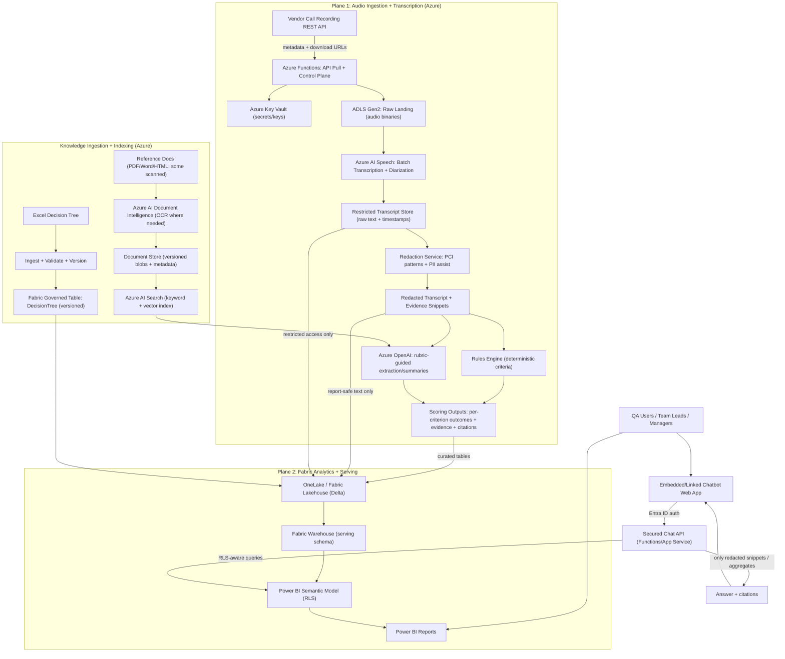

# Enercare Post-Call QA Automation (Azure + Fabric) — Presales Solution Outline

> **Feasibility verdict: GO WITH CONDITIONS (medium confidence)**
>
> Conditions:
> - Close open blocker Q1 with real vendor audio samples + metadata contract (formats, channels, rate limits, identifiers) before committing to fixed scope/cost.
> - Confirm whether a QA system-of-record must be integrated in MVP vs phase 2 (open blocker Q6).
> - Confirm expected Power BI + chatbot user counts/concurrency and licensing/capacity approach (open blocker Q8).
> - Confirm explainability/audit retention requirements beyond the assumed 90-day transcript/evidence retention (open blocker Q9).
> - Lock the CURE rubric (criteria, weights, examples, adjudication rules) early to avoid rework and acceptance disputes.
> Key risks driving this verdict:
> - Audio transcription/diarization approach and accuracy depend on unknown channel configuration and audio quality; wrong assumption can cause major rework (Q1).
> - Embedding a chatbot inside Power BI has high UX/security/RLS leakage risk and may require an external app pattern (chunk_12, chunk_13).
> - Fabric + Power BI capacity/cost surprises for heavy text analytics and refresh/concurrency (chunk_11).
> - RLS combined with sensitive text fields increases leakage and performance risk; requires adversarial testing and minimized transcript exposure (chunk_15).
> - CURE scoring definition and evidentiary expectations are a primary rework/acceptance risk if not locked early (chunk_2, chunk_40).

_Recommend delivering an Azure-based, once-daily batch pipeline that retrieves prior-day sampled call recordings, performs diarization/transcription, scores calls against the CURE metric using a rules + LLM-assisted evidence extraction approach grounded in the solution-finder decision tree and 2000+ reference documents, and publishes results to Fabric + Power BI with an embedded Q&A chatbot. Timeline and cost will be provided as ROM ranges pending resolution of the remaining discovery decisions (vendor audio formats/metadata, QA system-of-record alignment, user/concurrency sizing, and final explainability retention). MVP output will land in a Fabric Lakehouse/Warehouse and Power BI dataset, with optional phase-2 write-back to QA/CRM systems._

## Global Assumptions

- Call recordings are retrievable via a vendor-provided REST API with per-call download URLs, and Enercare has rights to process audio and store derived transcripts/metadata in their Azure tenant; retention is at least 30 days at the vendor.
- CURE scoring will be implemented as a rules + LLM-assisted evidence extraction approach: per-criterion pass/fail with weighted roll-up, producing per-call and per-agent scores plus evidence snippets and citations to the decision tree/documents.
- Clarify/Talesin/Zoro checks will initially be inferred from call transcript phrases and/or case notes rather than hard audit logs; phase 2 would add API-based evidence if available.
- English-only calls, average 8 minutes, P95 20 minutes; mostly single mixed channel audio (mono) in MP3/WAV at 8–16kHz; daily volume suitable for overnight batch (e.g., 500–2,000 calls/day sampled subset).
- PII is present; transcripts must be stored with restricted access, encrypted at rest, and retained 90 days; redaction of payment card data is required; data must remain in a Canadian Azure region (or Enercare’s standard region) with audit logging enabled.
- The solution-finder Excel is a structured decision tree with stable node IDs and versioning by file/date; updates occur monthly or ad hoc and must be re-ingested on change.
- The 2000+ reference documents are mostly digital PDFs/Word/HTML with some scanned PDFs; ingestion will use OCR where needed and be refreshed on a scheduled cadence (e.g., weekly/monthly) with a named content owner.
- Power BI access is internal only with role-based access; row-level security is required by manager/team; transcripts are not broadly visible—only QA/authorized roles see full text, others see summaries and scores.
- MVP write-back is to a Fabric Lakehouse/warehouse and Power BI dataset only; optional phase 2 pushes results to a QA tool/CRM via API.
- Batch runs once daily and must complete before business hours (e.g., by 6am local time) for the prior day’s sampled calls.
- GenAI must not train on Enercare data; all processing stays within Enercare’s Azure tenant using Azure OpenAI with private networking where feasible; prompts/responses are logged with redaction.
- Vendor API is expected to provide call metadata (callId, agentId, timestamps, category/queue) and MP3/WAV mono audio; if category is missing, it will be classified from transcript in MVP.
- Power BI audience is assumed to be internal (~50–200 total users, 5–20 concurrent) and chatbot usage is assumed low concurrency for QA + team leads/managers.
- Explainability is assumed required for QA roles with evidence snippets + citations retained 90 days; aggregated scores may be retained longer (e.g., 1–2 years) without raw text.
- MVP will not migrate historical QA scores; optional import of a baseline dataset (last 3–6 months) may be supported once available.

## Executive Summary

### Proposed MVP (batch QA scoring + dashboard + chatbot)

Enercare is seeking an end-to-end **Azure-based application for post-call QA automation using batch (not real-time) processing**, designed to run **once daily** to process the prior day’s sampled calls and complete before business hours. (Quote: “Enercare wants an end-to-end Azure-based application…using once-daily batch processing (not real time).” — **Approved Presales Brief**; Quote: “Batch processing (not real time); automation can run once every 24 hours.” — **Non-Functional Requirements**; Quote: “Run batch automation once daily…complete before business hours (e.g., by 6am local time).” — **Functional Requirements**)

In the **MVP**, Enercare will receive:
- **Batch retrieval of stored call recordings** from the vendor using a REST API and per-call download URLs. (Quote: “Retrieve call recordings via a vendor-provided REST API using per-call download URLs.” — **Functional Requirements**)
- **Diarization and transcription** as part of the batch pipeline. (Quote: “Perform diarization and transcription of call audio as part of the batch pipeline.” — **Functional Requirements**)
- **CURE scoring with defensible outputs** using a **rules + LLM-assisted evidence extraction approach**, grounded in Enercare’s **solution-finder decision tree** (structured Excel with stable node IDs/versioning) and **2000+ reference documents** (including OCR for scanned PDFs). Outputs include per-criterion pass/fail, weighted roll-up, and evidence snippets with timestamps and citations back to the decision tree and reference sources. (Quote: “Score calls on the CURE metric using a rules + LLM-assisted evidence extraction approach…” — **Functional Requirements**; Quote: “Use the solution-finder decision tree…Excel…stable node IDs and versioning…” — **Functional Requirements**; Quote: “Ingest and use 2000+ reference documents…with OCR where needed…” — **Functional Requirements**; Quote: “Store per-criterion evidence snippets with transcript timestamps, plus citations…” — **Non-Functional Requirements**)
- **Power BI dashboard + embedded chatbot** to surface per-call/per-agent scores and enable Q&A over the scored results and curated knowledge sources (within Enercare’s tenant). (Quote: “Surface agent scores/insights in a Power BI dashboard with an embedded chatbot for Q&A.” — **Functional Requirements**; Quote: “surface…in a dashboard with an embedded chatbot” — **Project Summary**)

**MVP write-back/output storage is limited to analytics**: results are written to a **Fabric Lakehouse/Warehouse and the Power BI dataset only**. **Phase 2** can optionally add **API-based push** of results into a QA tool/CRM if/when Enercare confirms the target system(s) and required SLAs. (Quote: “MVP write-back/output storage is to a Fabric Lakehouse/warehouse and Power BI dataset only.” — **Functional Requirements**; Quote: “Optionally (phase 2) push results to a QA tool/CRM via API.” — **Functional Requirements**)

### Recommended Azure/Fabric-centric approach

A **Microsoft-centric architecture (Azure + Microsoft Fabric + Power BI)** is recommended to align to the requested technology direction and keep processing, storage, and GenAI inference inside Enercare’s Azure tenant. (Quote: “Technologies Identified: Azure, Microsoft Fabric, Power BI…” — **Pre-Sales Analysis Context**; Quote: “All processing stays within Enercare’s Azure tenant using Azure OpenAI…” — **Non-Functional Requirements**)

At a high level, the recommended approach is:
- **Batch orchestration & ingestion**: scheduled pipelines retrieve call audio/metadata and re-ingest the decision tree Excel and reference documents on change / on a cadence. (Quote: “Run batch automation once daily…” — **Functional Requirements**; Quote: “re-ingest on change (monthly or ad hoc)” — **Functional Requirements**; Quote: “refresh ingestion on a scheduled cadence (e.g., weekly/monthly)” — **Functional Requirements**)
- **AI processing in-tenant**: diarization/transcription, followed by CURE scoring with rules plus LLM-assisted evidence extraction; prompts/responses are logged with redaction, and Enercare data is not used for model training. (Quote: “rules + LLM-assisted evidence extraction…” — **Functional Requirements**; Quote: “GenAI must not train on Enercare data…prompts/responses are logged with redaction.” — **Non-Functional Requirements**)
- **Data products & reporting in Fabric/Power BI**: store transcripts/evidence (time-bound) and curated scoring outputs in Fabric, serve to Power BI with appropriate security (RLS), and embed the chatbot in the reporting experience. (Quote: “MVP write-back/output storage is to a Fabric Lakehouse/warehouse and Power BI dataset only.” — **Functional Requirements**; Quote: “Power BI…row-level security is required…” — **Non-Functional Requirements**)

Assumption: Specific Azure service selections and SKUs (e.g., orchestration, search/vector, and transcription implementation choices) will be finalized during solution design once vendor audio/channel details and the final explainability/audit requirements are confirmed. (Quote: “Open Blockers / Decisions Pending…” — **Open Blockers / Decisions Pending**)

### Key constraints (Canada region, PII/PCI redaction, RLS, retention)

The solution must meet the following security/compliance constraints:
- **Canadian data residency** (or Enercare’s standard Canadian region) with audit logging enabled. (Quote: “Data must remain in a Canadian Azure region…with audit logging enabled.” — **Non-Functional Requirements**)
- **PII controls**: transcripts contain PII and must be **encrypted at rest** with restricted access. (Quote: “PII is present; transcripts must be stored with restricted access and encrypted at rest.” — **Non-Functional Requirements**)
- **PCI/payment card redaction**: payment card data must be redacted. (Quote: “Redaction of payment card data is required.” — **Non-Functional Requirements**)
- **Power BI access controls + Row-Level Security (RLS)**: internal-only access with role-based permissions; **RLS by manager/team**; transcripts not broadly visible—only QA/authorized roles see full text, others see summaries and scores. (Quote: “Power BI access is internal only…row-level security is required…” — **Non-Functional Requirements**)
- **Retention**: transcripts and evidence retained **90 days** (with aggregated scores potentially retained longer without raw text). (Quote: “Transcripts retained 90 days.” — **Non-Functional Requirements**; Quote: “retain evidence for 90 days…aggregated scores can be retained longer” — **Non-Functional Requirements**)

### Open decisions preventing firm sizing

Firm timeline/cost sizing is blocked pending confirmation of the following open decisions, each of which can materially change design complexity, testing scope, and platform consumption:
1. **Vendor audio formats/channel configuration & metadata completeness** (e.g., MP3/WAV; mono vs stereo/separate channels; presence of callId/agentId/timestamps/category). This drives transcription/diarization approach, error handling, and the extent of required enrichment (e.g., category inference). (Quote: “Q1 — What are the exact audio formats and channel configuration…do we receive metadata…?” — **Open Blockers / Decisions Pending**; Quote: “If call category metadata is missing, classify category from transcript in MVP.” — **Functional Requirements**)
2. **QA system-of-record alignment**: whether Enercare has an existing QA tool/workflow that the MVP must align to (assignments, historical scores, workflow states), or whether analytics-only output is sufficient until Phase 2 integration. (Quote: “Q6 — Is there an existing QA system of record…do we need to migrate/align with it?” — **Open Blockers / Decisions Pending**; Quote: “MVP write-back…Fabric…only; optional phase 2…via API.” — **Functional Requirements**)
3. **Expected dashboard/chatbot audience and concurrency**: number of users, concurrency expectations, and whether the chatbot is QA-only or broader management. This affects semantic model design, governance, and capacity planning. (Quote: “Q8 — How many dashboard users and chatbot users are expected…?” — **Open Blockers / Decisions Pending**)
4. **Final explainability/audit trail and retention requirements**: confirmation of the minimum evidence required per score (snippets, timestamps, citations) and whether any retention is required beyond the current 90-day transcript/evidence assumption. This affects storage, access control patterns, and UI drill-down requirements. (Quote: “Q9 — Do you require explainability/audit trails…how long…retained?” — **Open Blockers / Decisions Pending**; Quote: “Explainability…evidence snippets…retain evidence for 90 days…” — **Non-Functional Requirements**)

### ROM timeline/cost (explicitly dependent on the open questions)

**ROM (schedule):** The following is a *conditional* timeline range for an MVP, **explicitly dependent on closing Q1/Q6/Q8/Q9 above**. The range assumes once-daily batch, English-only calls, and MVP output limited to Fabric/Power BI (no operational system write-back). (Quote: “once-daily batch processing (not real time)” — **Approved Presales Brief**; Quote: “MVP write-back…Fabric…only” — **Functional Requirements**)

- **Phase 0 — Discovery & solution design (2–4 weeks, ROM)**  
  Confirms vendor audio/metadata realities, security model (RLS + transcript access), and the scoring/evidence pattern.  
  *Moves lower* if audio is consistently mono MP3/WAV with complete metadata; *moves higher* if formats vary, channels differ, or metadata is missing/inconsistent. (Quote: “Q1…” — **Open Blockers / Decisions Pending**)

- **Phase 1 — MVP build (6–10 weeks, ROM)**  
  Build batch ingestion, diarize/transcribe, decision-tree + document ingestion (incl. OCR where needed), CURE scoring with evidence/citations, Fabric storage model, Power BI dashboard and embedded chatbot.  
  *Moves lower* if explainability requirements remain at the assumed 90-day evidence retention; *moves higher* if stronger auditability/retention is required or if document OCR/ingestion complexity is higher than expected. (Quote: “Ingest…2000+ reference documents…OCR” — **Functional Requirements**; Quote: “Explainability…retain evidence for 90 days…” — **Non-Functional Requirements**)

- **Phase 2 — Security hardening, performance & release readiness (2–4 weeks, ROM)**  
  RLS validation, redaction verification, audit logging checks, and operational runbook/monitoring for the overnight batch window.  
  *Moves higher* with larger-than-expected user/concurrency requirements for dashboard/chatbot, or stricter requirements for prompt/response logging and audit review workflows. (Quote: “Power BI…row-level security…” — **Non-Functional Requirements**; Quote: “prompts/responses are logged with redaction.” — **Non-Functional Requirements**; Quote: “Q8…” — **Open Blockers / Decisions Pending**)

**ROM (cost):** A numeric cost ROM is **not yet defensible** until Q1/Q6/Q8/Q9 are closed because (a) audio/channel/metadata variability affects engineering effort and transcription/diarization run-cost, (b) QA system-of-record alignment can introduce additional integration scope, (c) expected dashboard/chatbot usage affects capacity/governance requirements, and (d) explainability/retention requirements affect secure storage, access patterns, and testing scope. (Quote: “Open Blockers / Decisions Pending…” — **Open Blockers / Decisions Pending**)  
Assumption: A bounded cost ROM will be produced immediately after those decisions are confirmed, using Enercare-confirmed volumes (calls/day and duration), document/OCR scope, required audit retention posture, and target user/concurrency for Power BI/chatbot. (Quote: “Q1…Q6…Q8…Q9…” — **Open Blockers / Decisions Pending**; Quote: “average 8 minutes, P95 20 minutes…” — **Non-Functional Requirements**)

<!-- judge: revised: ROM timeline/cost requirement is not met: the section says a ROM cannot be provided until open decisions are closed, but the contract requires a ROM timeline/cost statement explicitly marked as dependent on open questions (without inventing numbers). -->

## Project Scope (MVP and Phase 2)

### MVP scope (in scope)

#### Batch cadence, input population, and completion window
- The MVP runs as an overnight batch **once daily** to process **the prior day’s sampled calls**, and it must complete **before business hours (e.g., by 6am local time)**. This explicitly excludes near-real-time scoring and same-day call processing. ([FR-2](#), [Q7](#))
  - Assumption: “Sampled calls” are determined by an upstream sampling process or a vendor/API filter and are made available to the pipeline as a daily list of callIds for the prior day; MVP does not design or govern the sampling methodology beyond consuming the provided sampled set.

#### Call audio retrieval (vendor integration boundary)
- The MVP **retrieves call recordings via a vendor-provided REST API using per-call download URLs**. Retrieval is limited to pull (read) operations for audio and associated metadata; no changes are written back to the vendor system in MVP. ([FR-1](#))

#### Audio processing and transcript generation
- The MVP batch pipeline includes **diarization and transcription** for each retrieved call recording as part of end-to-end processing. ([FR-3](#))

#### Scoring, evidence, and explainability outputs
- The MVP generates CURE scoring outputs as:
  - **Per-call and per-agent scores**, and
  - **Evidence snippets with citations** that link back to **decision-tree nodes** and **reference documents** supporting each scoring outcome. ([FR-5](#))

#### Decision tree ingestion and versioning
- The “solution-finder” decision tree is sourced from a **structured Excel file** with **stable node IDs** and **versioning by file/date**; it is **re-ingested on change (monthly or ad hoc)**. ([FR-6](#), [Q2](#))

#### Reference content ingestion (2000+ documents)
- The MVP ingests and uses **2000+ reference documents** across **PDF/Word/HTML**, including **some scanned PDFs**, applying **OCR where needed**. Content is refreshed on a **scheduled cadence (e.g., weekly/monthly)** and has a **named content owner** responsible for governance and updates. ([FR-7](#), [Q3](#))

#### Storage and reporting boundary (no operational write-back)
- MVP output storage/write-back is limited to **Microsoft Fabric Lakehouse/Warehouse and the Power BI dataset**; no write-back to QA tools or CRM occurs in MVP. ([FR-10](#), [Q5](#))

#### Power BI dashboard and chatbot experience
- The MVP surfaces agent scores/insights in a **Power BI dashboard** and includes an **embedded chatbot for Q&A** over the scored outputs and supporting evidence/citations. ([FR-9](#))

---

### Phase 2 scope (planned extensions)

#### Downstream system integration (QA/CRM write-back)
- Phase 2 may add the ability to **push results to a QA tool and/or CRM via API**, enabling operational workflows such as case creation, QA assignment, adjudication, or closing-the-loop actions outside Fabric/Power BI. ([FR-11](#), [Q5](#))

#### Stronger evidence signals for system checks (if available)
- While MVP infers certain checks from transcript phrases and/or case notes, Phase 2 may incorporate **API-based evidence** (e.g., direct system-of-record confirmations) **if available**, to reduce reliance on inference. ([FR-8](#))

---

### Out of scope (explicit exclusions)

#### Historical QA score migration
- The MVP will **not migrate historical QA scores** into the new platform. An **optional baseline import** (e.g., last **3–6 months**) may be supported later for comparative analytics once a baseline dataset is available. ([Out of Scope—Historical QA](#), [Accepted Assumption—Baseline Import](#))

#### Real-time / intra-day processing
- Any processing other than **once-daily prior-day batch** (e.g., streaming transcription/scoring, same-day dashboards, or intraday reprocessing) is out of scope for MVP and would require separate sizing and design. ([FR-2](#), [Q7](#))

---

### MVP deliverables

1. **Batch pipelines (Fabric/Azure-aligned)**
   - Vendor audio + metadata retrieval via REST API (per-call download URL pattern). ([FR-1](#))
   - Overnight orchestration to process prior-day sampled calls and finish before business hours (e.g., 6am). ([FR-2](#), [Q7](#))
   - Diarization + transcription as part of the batch. ([FR-3](#))
   - Scoring outputs with evidence snippets and citations to decision-tree nodes and reference documents. ([FR-5](#))

2. **Content ingestion components**
   - Decision-tree ingestion from structured Excel with stable node IDs, versioning, and re-ingestion on change (monthly/ad hoc). ([FR-6](#), [Q2](#))
   - Reference document ingestion (PDF/Word/HTML + OCR for scanned) with scheduled refresh and named content owner. ([FR-7](#), [Q3](#))

3. **Data model outputs (Fabric Lakehouse/Warehouse + Power BI dataset)**
   - Curated tables/views for per-call and per-agent scoring, evidence snippets, and citation pointers, persisted in Fabric storage and published via the Power BI dataset. ([FR-10](#), [Q5](#))

4. **Power BI dashboard**
   - Reporting views for agent/team performance and call-level drilldowns aligned to the generated score and evidence artifacts. ([FR-9](#))

5. **Chatbot integration pattern**
   - An embedded chatbot experience in Power BI that can answer questions over the scored outputs and supporting citations (without requiring write-back to operational systems in MVP). ([FR-9](#), [FR-10](#))

---

### Acceptance checkpoints (traceable to requirements)

- **Audio pull and metadata**: Demonstrate retrieval of call recordings via vendor REST API using per-call download URLs for a prior-day sampled set. ([FR-1](#))
- **Batch SLA**: Demonstrate a scheduled daily run that processes prior day sampled calls and completes before business hours (e.g., by 6am local time). ([FR-2](#), [Q7](#))
- **Speech processing**: Validate diarization + transcription completion for the sampled call set as part of the batch pipeline. ([FR-3](#))
- **Explainable scoring**: For a test set, produce per-call and per-agent scores with evidence snippets and citations that resolve to decision-tree node IDs and reference documents. ([FR-5](#))
- **Decision tree governance**: Confirm Excel-based decision tree ingestion preserves stable node IDs, captures version (file/date), and supports re-ingestion upon monthly/ad hoc updates. ([FR-6](#), [Q2](#))
- **Reference corpus ingestion**: Confirm ingestion of the reference corpus with OCR applied where needed and a scheduled refresh mechanism tied to a named content owner. ([FR-7](#), [Q3](#))
- **Storage boundary**: Verify MVP persists outputs only to Fabric Lakehouse/Warehouse and Power BI dataset, with no QA/CRM write-back. ([FR-10](#), [Q5](#))
- **Phase 2 integration readiness** (design checkpoint): Produce an integration approach for optional API-based push to QA/CRM in Phase 2 (not executed in MVP). ([FR-11](#), [Q5](#))
- **Out-of-scope confirmation**: Confirm no historical QA score migration is included in MVP; baseline import (3–6 months) remains optional for later. ([Out of Scope—Historical QA](#), [Accepted Assumption—Baseline Import](#))

## Requirements (Functional, Non-Functional, and Constraints)

### Functional Requirements

| ID | Requirement | Status | Evidence |
|---|---|---|---|
| **FR-1** | The system must retrieve call recordings via a vendor-provided REST API using **per-call download URLs**. | **Confirmed** | Quote: “**FR-1** Retrieve call recordings via a vendor-provided REST API using per-call download URLs.” *(Functional Requirements table)* |
| **FR-2** | The system must run a **once-daily batch** to process the **prior day’s sampled calls** and complete **before business hours** (e.g., by **6am local time**). | **Confirmed** | Quote: “**FR-2** Run batch automation once daily to process the prior day’s sampled calls and complete before business hours (e.g., by 6am local time).” *(Functional Requirements table)* |
| **FR-3** | The batch pipeline must perform **speaker diarization** and **transcription** of call audio. | **Confirmed** | Quote: “**FR-3** Perform diarization and transcription of call audio as part of the batch pipeline.” *(Functional Requirements table)* |
| **FR-4** | The system must score calls on the **CURE** metric using a **rules + LLM-assisted evidence extraction** approach: **per-criterion pass/fail** with a **weighted roll-up**. | **Confirmed** | Quote: “**FR-4** Score calls on the CURE metric using a rules + LLM-assisted evidence extraction approach: per-criterion pass/fail with weighted roll-up.” *(Functional Requirements table)* |
| **FR-5** | The system must generate **per-call** and **per-agent** outputs including **evidence snippets** with **transcript timestamps** and **citations** to **decision-tree node IDs** and **document IDs/sections**. | **Confirmed** | Quote: “**FR-5** Produce per-call and per-agent scores plus evidence snippets and citations to the decision tree/documents.” *(Functional Requirements table)*; plus quote: “store per-criterion evidence snippets with transcript timestamps, plus citations to decision-tree node IDs and document IDs/sections” *(Non-Functional Requirements table, explainability)* |
| **FR-6** | The solution-finder decision tree must be ingested from a **structured, versioned Excel** source with **stable node IDs** and be **re-ingested on change** (monthly or ad hoc). | **Confirmed** | Quote: “**FR-6** Use the solution-finder decision tree sourced from a structured Excel file with stable node IDs and versioning by file/date; re-ingest on change (monthly or ad hoc).” *(Functional Requirements table)* |
| **FR-7** | The system must ingest and use **2000+ reference documents** (PDF/Word/HTML; some scanned PDFs) and perform **OCR** where needed; it must support **scheduled refresh** (e.g., weekly/monthly) with a **named content owner**. | **Assumption (to confirm)** | Quote: “[SYSTEM ASSUMPTION] The 2000+ reference documents are mostly digital PDFs/Word/HTML with some scanned PDFs; ingestion will use OCR where needed and be refreshed on a scheduled cadence (e.g., weekly/monthly) with a named content owner.” *(Open question response for document corpus)* |
| **FR-8** | The system must initially infer **Clarify/Talesin/Zoro** checks from call transcript phrases and/or case notes; phase 2 may add API-based evidence if available. | **Confirmed** | Quote: “**FR-8** Initially infer Clarify/Talesin/Zoro checks from call transcript phrases and/or case notes (not hard audit logs); phase 2 may add API-based evidence if available.” *(Functional Requirements table)* |
| **FR-9** | The system must surface agent scores/insights in a **Power BI** dashboard with an **embedded chatbot** for Q&A. | **Confirmed** | Quote: “**FR-9** Surface agent scores/insights in a Power BI dashboard with an embedded chatbot for Q&A.” *(Functional Requirements table)* |
| **FR-10** | **MVP write-back/output storage** must be to a **Fabric Lakehouse/warehouse and Power BI dataset only**. | **Confirmed** | Quote: “**FR-10** MVP write-back/output storage is to a Fabric Lakehouse/warehouse and Power BI dataset only.” *(Functional Requirements table)* |
| **FR-11** | Optionally (**phase 2**), the system may push results to a QA tool/CRM via API. | **Confirmed (optional / phase 2)** | Quote: “**FR-11** Optionally (phase 2) push results to a QA tool/CRM via API.” *(Functional Requirements table)* |
| **FR-12** | If call category metadata is missing, the system must **classify category from transcript** in MVP. | **Assumption (to confirm trigger conditions)** | Quote: “**FR-12** If call category metadata is missing, classify category from transcript in MVP.” *(Functional Requirements table)* |

---

### Non-Functional Requirements

| ID | Requirement | Status | Evidence |
|---|---|---|---|
| **NFR-1** | The solution must be **batch** (not real-time), with automation running once every **24 hours**. | **Confirmed** | Quote: “**NFR-1** Batch processing (not real time); automation can run once every 24 hours.” *(Non-Functional Requirements table)* |
| **NFR-2** | The solution must support **English-only** calls; average **8 minutes**, P95 **20 minutes**; mostly **single mixed channel audio (mono)** in **MP3/WAV** at **8–16kHz**; daily volume suitable for overnight batch (e.g., **500–2,000 calls/day** sampled subset). | **Assumption (to confirm)** | Quote: “**NFR-2** English-only calls; average 8 minutes, P95 20 minutes; mostly single mixed channel audio (mono) in MP3/WAV at 8–16kHz; daily volume suitable for overnight batch (e.g., 500–2,000 calls/day sampled subset).” *(Non-Functional Requirements table)* |
| **NFR-3** | Enercare must have rights to process audio and store derived transcripts/metadata in their Azure tenant; vendor retention at least **30 days**. | **Assumption (to confirm)** | Quote: “**NFR-3** Enercare has rights to process audio and store derived transcripts/metadata in their Azure tenant; retention at least 30 days at the vendor.” *(Non-Functional Requirements table)* |
| **NFR-4** | Because **PII is present**, transcripts must be stored with **restricted access** and **encrypted at rest**. | **Confirmed** | Quote: “**NFR-4** PII is present; transcripts must be stored with restricted access and encrypted at rest.” *(Non-Functional Requirements table)* |
| **NFR-5** | The system must perform **redaction of payment card data**. | **Confirmed** | Quote: “**NFR-5** Redaction of payment card data is required.” *(Non-Functional Requirements table)* |
| **NFR-6** | Transcripts must be retained **90 days**. | **Confirmed** | Quote: “**NFR-6** Transcripts retained 90 days.” *(Non-Functional Requirements table)* |
| **NFR-7** | Data must remain in a **Canadian Azure region** (or Enercare’s standard region) with **audit logging enabled**. | **Confirmed** | Quote: “**NFR-7** Data must remain in a Canadian Azure region (or Enercare’s standard region) with audit logging enabled.” *(Non-Functional Requirements table)* |
| **NFR-8** | Power BI access must be **internal only**, with **role-based access** and **row-level security (RLS)** by manager/team; **full transcripts are only visible to QA/authorized roles**, while others see summaries/scores. | **Confirmed** | Quote: “**NFR-8** Power BI access is internal only with role-based access; row-level security is required by manager/team; transcripts are not broadly visible—only QA/authorized roles see full text, others see summaries and scores.” *(Non-Functional Requirements table)* |
| **NFR-9** | GenAI processing must remain within Enercare’s **Azure tenant** using **Azure OpenAI**; **no training** on Enercare data; **private networking where feasible**; **prompts/responses logged with redaction**. | **Confirmed** | Quote: “**NFR-9** GenAI must not train on Enercare data; all processing stays within Enercare’s Azure tenant using Azure OpenAI with private networking where feasible; prompts/responses are logged with redaction.” *(Non-Functional Requirements table)* |
| **NFR-10** | Explainability for QA roles: store per-criterion **evidence snippets** with **transcript timestamps**, plus **citations** to decision-tree node IDs and document IDs/sections; retain evidence **90 days** aligned to transcript retention; aggregated scores may be retained longer (e.g., **1–2 years**) without raw text. | **Confirmed** | Quote: “**NFR-10** Explainability for QA roles: store per-criterion evidence snippets with transcript timestamps, plus citations to decision-tree node IDs and document IDs/sections; retain evidence for 90 days aligned to transcript retention, while aggregated scores can be retained longer (e.g., 1–2 years) without raw text.” *(Non-Functional Requirements table)* |

---

### Constraints (Security, Compliance, and Governance)

These constraints apply across the functional and non-functional requirements.

#### Data residency (Canada) and audit logging
- All data processing and storage must remain in a **Canadian Azure region (or Enercare’s standard region)** and have **audit logging enabled**. *(Confirmed)* Quote: “Data must remain in a Canadian Azure region (or Enercare’s standard region) with audit logging enabled.” *(Non-Functional Requirements table, NFR-7)*

#### Retention (transcripts and explainability evidence)
- **Transcripts** must be retained **90 days**. *(Confirmed)* Quote: “Transcripts retained 90 days.” *(Non-Functional Requirements table, NFR-6)*
- **Explainability evidence** (snippets, timestamps, citations) must be retained **90 days aligned to transcript retention**; **aggregated scores** may be retained longer (e.g., **1–2 years**) without raw text. *(Confirmed)* Quote: “retain evidence for 90 days aligned to transcript retention, while aggregated scores can be retained longer (e.g., 1–2 years) without raw text.” *(Non-Functional Requirements table, NFR-10)*

#### Encryption and access restriction (PII)
- Because **PII is present**, transcripts must be stored with **restricted access** and **encrypted at rest**. *(Confirmed)* Quote: “PII is present; transcripts must be stored with restricted access and encrypted at rest.” *(Non-Functional Requirements table, NFR-4)*

#### Redaction (payment card data / PCI)
- The system must support **payment card data redaction** (including in stored transcripts and any stored evidence snippets where card data could appear). *(Confirmed)* Quote: “Redaction of payment card data is required.” *(Non-Functional Requirements table, NFR-5)*

#### GenAI policy constraints
- GenAI processing must stay within Enercare’s **Azure tenant** using **Azure OpenAI**; **no training** on Enercare data; **private networking where feasible**; **prompts/responses logged with redaction**. *(Confirmed)* Quote: “GenAI must not train on Enercare data; all processing stays within Enercare’s Azure tenant using Azure OpenAI with private networking where feasible; prompts/responses are logged with redaction.” *(Non-Functional Requirements table, NFR-9)*

#### Power BI access control, RLS, and transcript visibility
- Power BI must be **internal-only** with **role-based access** and **row-level security (RLS)** by **manager/team**; **full transcripts** must only be visible to **QA/authorized roles** (others see summaries/scores). *(Confirmed)* Quote: “Power BI access is internal only with role-based access; row-level security is required by manager/team; transcripts are not broadly visible—only QA/authorized roles see full text, others see summaries and scores.” *(Non-Functional Requirements table, NFR-8)*

---

### Open Decisions Impacting Requirements

1. **Audio channel configuration and metadata availability (affects FR-3, FR-12, NFR-2)**
   - Confirm whether calls are consistently **mono mixed-channel** versus stereo/separate agent/customer channels, and which metadata fields are reliably provided per call (e.g., agentId, queue/category). This impacts diarization approach/accuracy and whether **FR-12** is frequently triggered. *(Working assumption to confirm: the audio/volume characteristics stated in NFR-2.)* Quote: “mostly single mixed channel audio (mono)… MP3/WAV at 8–16kHz… (e.g., 500–2,000 calls/day sampled subset).” *(Non-Functional Requirements table, NFR-2)*

2. **QA system-of-record / write-back scope (affects FR-10, FR-11)**
   - Confirm whether Fabric + Power BI is the only MVP storage target (per **FR-10**) or whether any write-back to a QA tool/CRM is needed earlier than phase 2 (would change integration/security acceptance criteria). Quote: “MVP write-back/output storage is to a Fabric Lakehouse/warehouse and Power BI dataset only.” *(Functional Requirements table, FR-10)* and “Optionally (phase 2) push results to a QA tool/CRM via API.” *(Functional Requirements table, FR-11)*

3. **User counts and concurrency (affects dashboard sizing and access model under NFR-8)**
   - Validate the expected number of internal Power BI users and concurrent access patterns (including embedded chatbot usage), as this may influence dataset refresh strategy, capacity planning, and throttling controls. *(No quantitative requirement is confirmed in the cited NFRs; this remains an open sizing input.)*

4. **Explainability retention beyond 90 days (affects NFR-6, NFR-10)**
   - Confirm whether any QA/legal/regulatory need requires keeping **full transcripts and/or evidence snippets** longer than **90 days**, or if the confirmed approach (90 days for raw text/evidence; longer for aggregated scores without raw text) is sufficient. Quote: “retain evidence for 90 days aligned to transcript retention, while aggregated scores can be retained longer (e.g., 1–2 years) without raw text.” *(Non-Functional Requirements table, NFR-10)*

5. **Reference content governance (affects FR-7)**
   - Confirm the **named content owner** and the operational cadence/approval process for refreshing the **2000+ reference documents**, as FR-7 is currently captured as a system assumption and impacts auditability of citations. Quote: “[SYSTEM ASSUMPTION] …refresh … on a scheduled cadence (e.g., weekly/monthly) with a named content owner.” *(Open question response for document corpus)*

<!-- judge: revised: Does not meet the contract requirement to explicitly note which requirements are assumptions vs confirmed in a way that aligns with the validated requirements: several items marked as “Assumption (to confirm)” are actually stated as must/confirmed in the contract (e.g., FR-10 MVP storage boundary; NFR-8 RLS/transcript visibility; NFR-9 Azure OpenAI tenant/no-training/logging; NFR-10 explainability retention alignment).; Citation_completeness is weak because the “Evidence” column mostly repeats the requirement text rather than pointing to the agreed evidence pointers/chunks or clearly labeling as assumption with source; this undermines traceability for confirmed vs assumed items. -->

## Proposed Architecture (Azure + Fabric + Power BI)

### Target-state architecture principles (MVP)

**Explicit separation of concerns.** The MVP architecture is split into two planes:

1) **Audio ingestion + transcription plane (Azure services / custom compute)** responsible for pulling audio binaries, running speech-to-text + diarization, performing redaction, and producing scored “call-level artifacts” (transcript, redacted evidence, criterion outcomes). This separation is intentional because audio transcription/diarization commonly requires Azure AI services and/or custom compute (Functions/containers) and adds operational overhead that does not fit neatly into Fabric-native analytics tooling. [Quote: “Audio transcription/diarization may not fit neatly inside Fabric-native tooling; may require Azure AI services/custom compute…”](#evidence-links)

2) **Analytics + serving plane (Microsoft Fabric + Power BI)** responsible for governed persistence, aggregation, and consumption via a semantic model with RLS. This ensures BI queries remain performant and governable, while raw audio/transcripts remain restricted. [Quote: “Separate architecture into (1) audio ingestion/transcription services and (2) Fabric analytics layer…”](#evidence-links), [Quote: “MVP write-back/output storage is to a Fabric Lakehouse/warehouse and Power BI dataset only.”](#evidence-links)

**Minimize sensitive text exposure.** Because RLS over sensitive text can create performance and leakage risks, the architecture stores (a) raw transcripts in a restricted zone, (b) redacted snippets and structured evidence for reporting, and (c) aggregates for broader audiences—plus export controls and RLS validation. [Quote: “Row-level security and sensitive text fields can degrade performance and increase leakage risk… Minimize raw transcript exposure, store redacted snippets…”](#evidence-links)

**Reproducible scoring + citations.** The decision tree (Excel) and reference documents (including scanned PDFs) are ingested into governed, versioned stores so each scored call can be traced to: decision-tree node IDs and document IDs/sections used at the time of scoring. [Quote: “Excel-based decision tree as a production dependency is brittle… Ingest Excel into a governed, versioned table…”](#evidence-links), [Quote: “Ingest and use 2000+ reference documents… some scanned PDFs… with OCR…”](#evidence-links), [Quote: “store per-criterion evidence… plus citations to decision-tree node IDs and document IDs/sections; retain evidence for 90 days…”](#evidence-links)

---

### Component diagram (logical)



**Notes on key components and why they are included (MVP):**
- **Azure Functions for vendor API pull/control-plane**: handles vendor pagination/throttling, idempotency, and retrieval of per-call audio URLs before handing off to processing/storage (an awkward fit for “analytics-first” tools). This also aligns with the explicit need to separate “non-Fabric” operational components from Fabric analytics. [Quote: “Explicitly separate the architecture into (1) audio ingestion/transcription services and (2) Fabric analytics layer…”](#evidence-links)
- **Secure landing in ADLS Gen2**: keeps raw audio binaries and intermediate artifacts in object storage with lifecycle controls (retention) and tight IAM, decoupled from BI-serving stores. (Assumption: lifecycle policies will be used to enforce transcript/evidence retention windows required by policy.)
- **Hybrid redaction**: deterministic PCI masking plus assisted PII spotting before any report-visible text is produced, reducing leakage risk in downstream BI/chat experiences. [Quote: “Minimize raw transcript exposure, store redacted snippets…”](#evidence-links)
- **Rules + LLM-assisted scoring**: rules deliver repeatability; the LLM assists with evidence extraction and summarization while citations tie outcomes to decision-tree node IDs and reference documents. [Quote: “store per-criterion evidence… plus citations to decision-tree node IDs and document IDs/sections…”](#evidence-links)
- **Decision tree and reference document ingestion**: Excel is treated as a governed input (versioned + validated), and scanned PDFs flow through OCR before indexing to enable consistent retrieval and citations. [Quote: “Use the solution-finder decision tree sourced from a structured Excel file with stable node IDs and versioning…”](#evidence-links), [Quote: “Ingest and use 2000+ reference documents… some scanned PDFs… with OCR…”](#evidence-links)

---

### Deployment diagram (MVP in Azure Canada region + Fabric tenant)

```mermaid
graph TD
  subgraph Azure["Azure Subscription (Canada region; private networking where feasible)"]
    subgraph Net["VNet + Private Endpoints"]
      PE1["Private Endpoint: Storage"]
      PE2["Private Endpoint: Key Vault"]
      PE3["Private Endpoint: Azure OpenAI"]
      PE4["Private Endpoint: AI Speech / AI Search (where supported)"]
    end

    subgraph Sec["Security"]
      Entra["Microsoft Entra ID"]
      KV["Azure Key Vault"]
      Mon["Azure Monitor / App Insights"]
    end

    subgraph Ingest["Ingestion + Processing"]
      Fn["Azure Functions (API Pull, Orchestration Helpers)"]
      ADLS["ADLS Gen2 (Raw Audio + Artifacts)"]
      Speech["Azure AI Speech (STT + Diarization)"]
      AOAI["Azure OpenAI (Extraction/Summarization)"]
      PII["PII/PCI Redaction Service (Functions + optional AI Language)"]
      DocAI["Azure AI Document Intelligence (OCR)"]
      Search["Azure AI Search (index + vectors)"]
    end

    Vendor["Vendor API (external)"] --> Fn
    Fn --> ADLS
    ADLS --> Speech
    Speech --> PII
    PII --> AOAI
    DocAI --> Search
    Mon --- Fn
    Mon --- PII
    Mon --- AOAI
    Mon --- Speech
    KV --> Fn
    KV --> PII
    Entra --> Fn
  end

  subgraph Fabric["Microsoft Fabric Capacity / Workspace"]
    Pipelines["Fabric Data Factory Pipelines (nightly schedule)"]
    LH["Fabric Lakehouse (Delta tables)"]
    WH["Fabric Warehouse (serving)"]
    SM["Power BI Semantic Model (RLS)"]
    PBI["Power BI Reports"]
  end

  subgraph Chat["Chatbot Experience"]
    Web["Chatbot Web App (App Service/Static Web Apps)"]
    API["Chatbot API (Functions/App Service)"]
  end

  Pipelines -->|copy curated outputs| LH
  Fn -->|control-plane + metadata| Pipelines
  ADLS -->|ingest artifacts| Pipelines
  LH --> WH --> SM --> PBI

  Web -->|Entra SSO| API
  API -->|query via semantic model (RLS)| SM
```

**Operational realism / risks addressed by the deployment split**
- The **audio/STT/diarization plane** introduces non-Fabric operational needs (secrets, retries, monitoring, networking), so it is deployed and monitored as first-class Azure workloads rather than hidden inside the analytics layer. [Quote: “Teams underestimate the ‘non-Fabric’ components and operational overhead (secrets, networking, retries, monitoring).”](#evidence-links)
- **RLS + sensitive text** is handled by restricting where raw transcript text can live and by serving primarily structured outputs and redacted snippets to BI. [Quote: “Minimize raw transcript exposure… enforce export controls, and validate RLS…”](#evidence-links)

---

### Nightly batch sequence (end-to-end: audio retrieval → dashboard available)

```mermaid
sequenceDiagram
  autonumber
  participant Vendor as "Vendor API"
  participant Fn as "Azure Functions (Pull/Control)"
  participant ADLS as "ADLS Gen2 (Raw Landing)"
  participant Speech as "Azure AI Speech (STT+Diarization)"
  participant Redact as "Redaction Service"
  participant AOAI as "Azure OpenAI (Extraction)"
  participant Search as "Azure AI Search (Docs Index)"
  participant FabPipe as "Fabric Pipeline (Scheduler)"
  participant Lake as "Fabric Lakehouse/Warehouse"
  participant Model as "Power BI Semantic Model (RLS)"
  participant PBI as "Power BI Reports"
  FabPipe->>Fn: Start nightly job (prior-day calls)
  Fn->>Vendor: List calls + retrieve download URLs (paged/throttled)
  Vendor-->>Fn: Call metadata + audio URLs
  Fn->>ADLS: Download audio to secure landing (idempotent write)
  Fn->>Speech: Submit batch transcription job (audio URI)
  Speech-->>Fn: Job complete + transcript w/ timestamps + diarization (if supported)
  Fn->>Redact: Apply PCI masking + PII redaction; generate report-safe snippets
  Redact-->>Fn: Redacted transcript + evidence-ready snippets
  Fn->>Search: Retrieve top-k policy/decision docs for citations (per criterion)
  Search-->>Fn: Document passages + IDs/sections
  Fn->>AOAI: Extract per-criterion evidence + suggested outcomes + summary (with citations)
  AOAI-->>Fn: Criterion evidence + scores + rationale (redacted/logged)
  FabPipe->>Lake: Load curated tables (transcripts*, evidence, scores, aggregates)
  Lake->>Model: Refresh semantic model (incremental)
  Model-->>PBI: Updated dataset available for dashboards
```

\*Raw transcript text is loaded only to restricted tables/permissions; report-facing models prioritize redacted snippets and structured evidence.

---

### Data products and governed persistence in Fabric (MVP)

**MVP “data products” persisted to Fabric Lakehouse/Warehouse**
- **Call-level**: transcript metadata (callId, agentId, timestamps), diarization markers (where available), call category (from vendor metadata or classified from transcript if missing). (Assumption: category classification is performed when vendor category is missing.)
- **Text artifacts**:
  - **Restricted**: raw transcript text (90-day retention) for QA-authorized roles only. [Quote: “transcripts are not broadly visible—only QA/authorized roles see full text…”](#evidence-links)
  - **Report-safe**: redacted transcript snippets tied to timestamps and criterion evidence. [Quote: “Minimize raw transcript exposure, store redacted snippets…”](#evidence-links)
- **Scoring artifacts**:
  - per-criterion pass/fail + weights, per-call score, per-agent rollups
  - per-criterion evidence snippets + citations (decision-tree node IDs + document IDs/sections), retained 90 days aligned to transcript retention. [Quote: “store per-criterion evidence snippets with transcript timestamps, plus citations to decision-tree node IDs and document IDs/sections; retain evidence for 90 days…”](#evidence-links)
- **Aggregates** (longer retention): team/manager/region trends; distribution metrics; compliance rates. (Assumption: aggregated scores can be retained longer than 90 days because they do not contain raw text.)

These are stored in **Fabric Lakehouse/Warehouse** and served through a **governed Power BI semantic model with RLS**, aligning with the MVP write-back constraint. [Quote: “MVP write-back/output storage is to a Fabric Lakehouse/warehouse and Power BI dataset only.”](#evidence-links)

---

### Knowledge ingestion: decision tree + documents (versioned, governed, citable)

**Decision tree (Excel)**
- Excel is not queried directly at scoring time; it is **ingested into Fabric as a governed, versioned table** with schema validation (stable node IDs, parent/child relationships, rule metadata). This mitigates the brittleness of Excel as a production dependency (schema drift, manual updates). [Quote: “Excel-based decision tree as a production dependency is brittle… Ingest Excel into a governed, versioned table with validation rules…”](#evidence-links), [Quote: “Use the solution-finder decision tree sourced from a structured Excel file with stable node IDs and versioning…”](#evidence-links)
- Each scored call stores `decisionTreeVersion` and the set of node IDs referenced, enabling reproducibility and auditability. (Assumption: scoring output schema includes decision tree version + node IDs.)

**Reference documents (2000+)**
- Documents are ingested on a cadence with a named content owner; scanned PDFs are OCR’d prior to indexing to enable retrieval and citations. [Quote: “Ingest and use 2000+ reference documents… some scanned PDFs… with OCR where needed; refresh ingestion…”](#evidence-links)
- Azure AI Search stores searchable chunks with metadata fields (document ID, section/page, effective date/version) to support **RAG with citations**. (Assumption: the index schema includes document versioning metadata and section/page anchors.)

---

### Power BI semantic model + RLS (serving)

**Model approach**
- The **semantic model** is built on Warehouse (star-ish serving schema for performance) with incremental refresh/partitioning for daily loads (especially evidence/snippet tables). (Assumption: incremental refresh is configured to meet the “available before business hours” batch objective.)
- **RLS is enforced** by manager/team (and optionally region) so users only see their authorized population. [Quote: “row-level security is required by manager/team”](#evidence-links)

**Handling sensitive text**
- To reduce leakage and performance issues, the model defaults to **aggregates + redacted evidence snippets**, while access to raw transcript tables is limited to QA roles and ideally separated into a QA-only report or separate dataset. This is directly responsive to the identified risk that RLS over sensitive text can be slow and can leak via exports/misconfiguration. [Quote: “Row-level security and sensitive text fields can degrade performance and increase leakage risk… Minimize raw transcript exposure…”](#evidence-links)
- Controls to apply alongside RLS: restrict “Export data” for broad audiences; apply adversarial testing of RLS rules and report interactions. [Quote: “enforce export controls, and validate RLS with adversarial testing.”](#evidence-links)

---

### Chatbot integration pattern (RLS-respecting, minimal transcript exposure)

**Why an external secured service pattern (not purely in-report):**
- An embedded chatbot has explicit security/RLS design risk; decision is required early on whether it is a custom visual vs embedded app, and it must query only through RLS-protected models or a secured API. [Quote: “Decide early whether the chatbot is a Power BI custom visual vs an embedded web app, and design it to query only through RLS-protected semantic models or a secured API.”](#evidence-links)
- Keeping the chatbot logic **outside** the report (web app + API) allows:
  - strong authentication (Entra ID) and authorization checks,
  - prompt/response logging with redaction,
  - guardrails that block returning raw transcript text except for QA-authorized roles,
  - controlled retrieval from governed sources (semantic model and/or curated redacted snippets).

**Recommended MVP pattern**
- **Chat UI** embedded in the report page (iframe/web content) or linked out to a companion app (subject to tenant policy). (Assumption: tenant policy permits embedding an internal web app in Power BI or providing a contextual deep link.)
- **Chat API** enforces:
  - user identity via Entra ID,
  - query execution through the **Power BI semantic model with RLS** (or a thin API that only returns already-redacted, RLS-filtered rows),
  - response shaping to provide **summaries + citations** rather than raw transcript spans for non-QA roles. [Quote: “transcripts are not broadly visible—only QA/authorized roles see full text, others see summaries and scores.”](#evidence-links)

This pattern is designed specifically to respect RLS and to minimize sensitive transcript exposure, addressing the high-severity leakage risk. [Quote: “Row-level security and sensitive text fields can degrade performance and increase leakage risk…”](#evidence-links)

---

### Evidence links

- [Quote: “Audio transcription/diarization may not fit neatly inside Fabric-native tooling; may require Azure AI services/custom compute and added ops overhead.”](#)  
- [Quote: “Separate architecture into (1) audio ingestion/transcription services and (2) Fabric analytics layer; plan DevOps/monitoring for both.”](#)  
- [Quote: “Excel-based decision tree as a production dependency is brittle (versioning, schema drift, manual update risk).”](#)  
- [Quote: “Ingest Excel into a governed, versioned table with validation rules; require change control and publish versions used per scored call.”](#)  
- [Quote: “Row-level security and sensitive text fields can degrade performance and increase leakage risk… Minimize raw transcript exposure, store redacted snippets, enforce export controls, and validate RLS with adversarial testing.”](#)  
- [Quote: “Decide early whether the chatbot is a Power BI custom visual vs an embedded web app, and design it to query only through RLS-protected semantic models or a secured API.”](#)  
- [Quote: “Use the solution-finder decision tree sourced from a structured Excel file with stable node IDs and versioning by file/date; re-ingest on change (monthly or ad hoc).”](#)  
- [Quote: “Ingest and use 2000+ reference documents (PDF/Word/HTML, some scanned PDFs) with OCR where needed; refresh ingestion on a scheduled cadence…”](#)  
- [Quote: “Surface agent scores/insights in a Power BI dashboard with an embedded chatbot for Q&A.”](#)  
- [Quote: “MVP write-back/output storage is to a Fabric Lakehouse/warehouse and Power BI dataset only.”](#)  
- [Quote: “Batch runs once daily and must complete before business hours (e.g., by 6am local time) for the prior day’s sampled calls.”](#)  
- [Quote: “Row-level security is required by manager/team… transcripts are not broadly visible—only QA/authorized roles see full text, others see summaries and scores.”](#)  
- [Quote: “store per-criterion evidence snippets with transcript timestamps, plus citations to decision-tree node IDs and document IDs/sections; retain evidence for 90 days…”](#)

### Recommended Tech Stack

| Layer | Choice | Alternatives | Rationale | Confidence |
|-------|--------|--------------|-----------|------------|
| infra | Azure (Canada region) landing zone with private networking where feasible | AWS (ca-central-1), GCP (northamerica-northeast1), On-prem | Client-stated Azure-first stack and explicit constraint that data must remain in a Canadian Azure region with audit logging; private networking is an assumed requirement for GenAI and sensitive data handling. | high |
| orchestration | Microsoft Fabric Data Factory (pipelines) for batch orchestration + Azure Functions for vendor API pull/control-plane tasks | Azure Data Factory (standalone), Apache Airflow (self-managed), Fabric notebooks-only orchestration | Fabric is a stated technology and is the serving/analytics layer; Fabric pipelines provide native scheduling/monitoring for daily batch, while Azure Functions handles vendor API pagination/throttling, signed URL retrieval, and idempotent control-plane logic that is awkward inside Fabric alone. | medium |
| audio_ingestion_storage | Azure Data Lake Storage Gen2 (Blob) as secure landing zone for audio + derived artifacts (transcripts, redacted snippets) with lifecycle policies | Fabric OneLake only (no separate landing), Azure Files, Azure SQL for binaries | Audio binaries and intermediate artifacts benefit from object storage semantics, lifecycle management, and tight IAM; also supports separation of duties between raw landing and curated Fabric tables. Fabric/OneLake remains the analytics store, but raw audio landing is safer and more operationally flexible. | medium |
| speech_to_text_and_diarization | Azure AI Speech (Batch Transcription / Conversation Transcription) with diarization where supported; fall back to channel-based separation when dual-channel audio exists | Azure OpenAI audio models (where available) for transcription, Self-hosted Whisper, AWS Transcribe, GCP Speech-to-Text | Requirement is Azure-tenant processing with Canadian region constraint; Azure AI Speech is the most direct Azure-native STT option with enterprise controls. Diarization feasibility depends on actual audio channel configuration (open blocker Q1). | medium |
| pii_pci_redaction | Hybrid redaction: deterministic PCI pattern detection + LLM-assisted PII spotting, with redaction applied before storing report-visible text; keep raw transcript in restricted zone only | Azure AI Language PII only, LLM-only redaction, No transcript storage (summaries only) | PCI redaction is required and must be reliable; deterministic patterns reduce false negatives for card numbers, while LLM/PII services help catch contextual PII. Also aligns with requirement that transcripts are restricted and not broadly visible. | medium |
| knowledge_ingestion_and_indexing | Azure AI Search for document indexing + vector search (RAG), with OCR via Azure AI Document Intelligence for scanned PDFs; decision tree ingested from Excel into governed Fabric tables with versioning | Fabric-only (no external search index), Elastic/OpenSearch vector search, Pinecone/Weaviate managed | RAG over 2000+ heterogeneous documents with OCR needs is a strong fit for Azure AI Search + Document Intelligence; also supports citations. Excel decision tree brittleness is mitigated by ingesting into versioned tables with validation. | medium |
| llm_runtime | Azure OpenAI (GPT-4.x class model) for evidence extraction, summarization, and rubric-guided scoring assistance; prompts/responses logged with redaction | OpenAI public API, Anthropic/Google models, Self-hosted LLM | Explicit requirement that GenAI processing stays within Enercare’s Azure tenant using Azure OpenAI with no training on Enercare data and private networking where feasible. | high |
| analytics_datastore | Microsoft Fabric Lakehouse (Delta) for curated tables + Fabric Warehouse for serving/BI-friendly schemas; Power BI semantic model on top with incremental refresh | Fabric Lakehouse only, Azure Synapse Dedicated SQL Pool, Azure SQL Database | Client-stated Fabric + Power BI stack; Lakehouse supports large text and incremental processing, while Warehouse/semantic model supports governed BI consumption and RLS patterns. | high |
| dashboard_and_chatbot_experience | Power BI dashboard with RLS + external secured chatbot web app embedded in report (or linked) that queries only authorized data via an API; avoid direct transcript free-text exposure for non-QA roles | Pure in-report chatbot (DAX/visual-only), Power BI custom visual chatbot directly calling LLM, Standalone chatbot outside Power BI only | Embedding chatbot inside Power BI is high risk for RLS/security; an external app pattern allows stronger authZ checks, prompt-guardrails, and controlled retrieval from RLS-protected semantic model or API while minimizing leakage of sensitive transcript text. | medium |
| auth | Microsoft Entra ID (Azure AD) for user auth + managed identities for service-to-service; Power BI RLS for data authorization | Custom JWT auth, Okta-only (without Entra integration), Service principals only | Power BI and Azure-native services integrate best with Entra ID; RLS requirement is explicit and should be enforced at the semantic model layer; managed identities reduce secret sprawl. | high |

**Cloud / OSS service options:**

- **Azure (Canada region) landing zone with private networking where feasible** — Azure: Azure Virtual Network + Private Link + Private DNS Zones (Preferred for private endpoints to Storage, Key Vault, Azure OpenAI, and AI services where supported.); AWS: Amazon VPC + AWS PrivateLink (Alternative if client shifts cloud; similar private endpoint pattern.); GCP: VPC + Private Service Connect (Alternative if client shifts cloud; similar private endpoint pattern.); OSS: Terraform (IaC) (Use for repeatable environment provisioning across clouds; pairs with cloud-native networking.)
- **Microsoft Fabric Data Factory (pipelines) for batch orchestration + Azure Functions for vendor API pull/control-plane tasks** — Azure: Microsoft Fabric Data Factory (Pipelines) + Azure Functions (Recommended: Fabric for data movement into Lakehouse; Functions for API pull, retries, throttling, and metadata normalization.); AWS: AWS Step Functions + AWS Lambda (Comparable orchestration/control-plane pattern if moved to AWS.); GCP: Cloud Composer (Airflow) + Cloud Functions (Comparable orchestration/control-plane pattern if moved to GCP.); OSS: Apache Airflow (Use if client requires OSS scheduler; higher ops overhead than Fabric-native pipelines.)
- **Azure Data Lake Storage Gen2 (Blob) as secure landing zone for audio + derived artifacts (transcripts, redacted snippets) with lifecycle policies** — Azure: Azure Storage Account (ADLS Gen2) + Lifecycle Management (Recommended for raw audio landing and 90-day retention enforcement; integrate with Private Endpoints.); AWS: Amazon S3 + Lifecycle Policies (Equivalent object storage option if moved to AWS.); GCP: Google Cloud Storage + Object Lifecycle Management (Equivalent object storage option if moved to GCP.); OSS: MinIO (Self-hosted S3-compatible object storage; only if cloud storage is not permitted.)
- **Azure AI Speech (Batch Transcription / Conversation Transcription) with diarization where supported; fall back to channel-based separation when dual-channel audio exists** — Azure: Azure AI Speech (Batch Transcription / Conversation Transcription) (Preferred managed STT; diarization quality depends on mono vs dual-channel and noise; validate with sample audio early.); AWS: Amazon Transcribe (Alternative if moved to AWS; supports diarization but would violate Azure-tenant constraint as stated.); GCP: Google Cloud Speech-to-Text (Alternative if moved to GCP; would violate Azure-tenant constraint as stated.); OSS: Whisper (open-source) on GPU (e.g., NVIDIA) + pyannote.audio for diarization (Use if Azure Speech is blocked by region/private networking constraints or cost; higher ops and GPU management overhead.)
- **Hybrid redaction: deterministic PCI pattern detection + LLM-assisted PII spotting, with redaction applied before storing report-visible text; keep raw transcript in restricted zone only** — Azure: Azure AI Language (PII) + Azure Functions (regex/tokenization) + Azure OpenAI (optional assist) (Recommended: combine deterministic PCI masking with managed PII detection; store redacted snippets for Power BI.); AWS: Amazon Comprehend PII + AWS Lambda (Comparable managed PII detection if moved to AWS.); GCP: Cloud DLP (Comparable managed DLP/PII detection if moved to GCP.); OSS: Presidio (Microsoft OSS) + custom regex rules (Self-hosted PII detection; use if managed services are blocked; requires tuning and ops.)
- **Azure AI Search for document indexing + vector search (RAG), with OCR via Azure AI Document Intelligence for scanned PDFs; decision tree ingested from Excel into governed Fabric tables with versioning** — Azure: Azure AI Search + Azure AI Document Intelligence (Recommended managed RAG index + OCR; validate Private Endpoint support and Canada region availability early.); AWS: Amazon OpenSearch Service (vector engine) + Amazon Textract (Comparable if moved to AWS; would violate Azure-tenant constraint as stated.); GCP: Vertex AI Search / Vector Search + Document AI OCR (Comparable if moved to GCP; would violate Azure-tenant constraint as stated.); OSS: Qdrant (vector DB) + Apache Tika + Tesseract OCR (OSS alternative if Azure AI Search/Doc Intelligence are blocked; higher ops and quality tuning.)
- **Azure OpenAI (GPT-4.x class model) for evidence extraction, summarization, and rubric-guided scoring assistance; prompts/responses logged with redaction** — Azure: Azure OpenAI Service (Recommended to meet tenant/data boundary requirements; use content filters and logging with redaction.); AWS: Amazon Bedrock (Alternative if moved to AWS; would not meet stated Azure OpenAI constraint.); GCP: Vertex AI (Gemini) (Alternative if moved to GCP; would not meet stated Azure OpenAI constraint.); OSS: vLLM serving Llama 3.x (self-hosted) (Use if Azure OpenAI is blocked by policy/region; requires GPU infra, model governance, and security hardening.)
- **Microsoft Fabric Lakehouse (Delta) for curated tables + Fabric Warehouse for serving/BI-friendly schemas; Power BI semantic model on top with incremental refresh** — Azure: Microsoft Fabric Lakehouse + Fabric Warehouse + Power BI Semantic Model (Recommended: separate raw/curated/serving zones; use incremental refresh and partitioning for transcript/evidence tables.); AWS: Amazon Redshift + S3 (Lakehouse pattern) (Alternative if moved to AWS; not aligned to stated Fabric requirement.); GCP: BigQuery + GCS (Alternative if moved to GCP; not aligned to stated Fabric requirement.); OSS: Delta Lake on Spark + Trino (OSS lakehouse alternative; higher ops and not aligned to stated Fabric preference.)
- **Power BI dashboard with RLS + external secured chatbot web app embedded in report (or linked) that queries only authorized data via an API; avoid direct transcript free-text exposure for non-QA roles** — Azure: Azure App Service (or Static Web Apps) + Azure Functions API + Power BI Embedded (optional) (Recommended: embed web app in Power BI via iframe/tab where allowed; enforce Entra ID auth and RLS-aware queries.); AWS: AWS Amplify + API Gateway + Lambda (Comparable external chatbot app pattern if moved to AWS.); GCP: Firebase Hosting + Cloud Run (Comparable external chatbot app pattern if moved to GCP.); OSS: Next.js web app + OAuth2 proxy (OSS web tier option; still requires secure hosting and integration with identity provider.)
- **Microsoft Entra ID (Azure AD) for user auth + managed identities for service-to-service; Power BI RLS for data authorization** — Azure: Microsoft Entra ID + Managed Identities (Recommended for end-user SSO and workload identity; pairs with Key Vault for remaining secrets.); AWS: AWS IAM Identity Center (Alternative if moved to AWS; would require different BI stack for RLS equivalence.); GCP: Cloud Identity (Alternative if moved to GCP; would require different BI stack for RLS equivalence.); OSS: Keycloak (OSS IdP option; adds ops overhead and still must integrate with Power BI/Entra for best experience.)

## Feasibility, Sizing, and ROM Cost

### Feasibility verdict (go-with-conditions) and what makes it feasible
The proposed approach is feasible **provided several sizing/security decisions are closed early**—notably the vendor audio/metadata contract, Power BI/chatbot usage expectations, whether a QA system-of-record must be integrated in MVP, and audit/retention requirements. These items are explicitly called out as open blockers in the current intake (e.g., “**What are the exact audio formats and channel configuration… and do we receive metadata**…”, “**How many dashboard users and chatbot users are expected**…”, “**Is there an existing QA system of record…**”, and “**Do you require explainability/audit trails… and how long must those be retained?**”). *(Evidence: “Open Blockers / Decisions Pending” list — Q1/Q6/Q8/Q9.)*

From an implementation standpoint, feasibility depends on **treating audio processing as a first-class integration layer** (API pull → transcription/diarization/redaction) and **Fabric as the analytics layer** (Lakehouse/Warehouse + Power BI semantic model). This separation is important because Fabric is strong for pipelines/analytics, but “**audio processing … often requires Azure AI services and/or custom compute … [and] ‘non-Fabric’ components and operational overhead**.” *(Evidence quote: “Audio transcription/diarization may not fit neatly inside Fabric-native tooling… may require Azure AI services/custom compute and added ops overhead.”)*

### ROM sizing approach (what we can estimate now vs what is blocked)
A ROM estimate can be structured as a set of **unit-cost multipliers** applied to the daily processing footprint, and then validated via a proof-of-volume run. Under the current sizing assumptions—“**English-only calls, average 8 minutes, P95 20 minutes; … mostly single mixed channel audio (mono) in MP3/WAV at 8–16kHz; … 500–2,000 calls/day sampled subset**”—the ROM can be derived by estimating:
- **Minutes of audio processed/day** (calls/day × duration distribution), split into average and tail (P95) to size batch windows and peak concurrency. *(Evidence: labeled assumption quote above.)*
- **Transcription + diarization minutes/day**, adjusted by channel configuration and expected overlap/noise (see “Primary cost drivers” below). *(Evidence: labeled assumption quote above; plus open blocker Q1 on channel/format.)*
- **Tokens and request volume** for LLM-assisted scoring and evidence extraction (driven by transcript length, rubric complexity, number of criteria, and whether you summarize first vs score on full text).
- **Embeddings volume** for reference content (decision tree + documents) and—if required—transcript embeddings for retrieval/search; plus re-index cadence (weekly/monthly) and incremental refresh strategy.
- **Fabric/Power BI capacity** requirements for storage, refresh windows, and interactive concurrency.

What remains blocked for firm sizing/pricing is concentrated in the open decisions:
- **Audio/channel specifics + metadata contract** (format, mono vs dual-channel, sample rate, noise level, availability/quality of callId/agentId/timestamps/category). *(Evidence: open blocker Q1 — “expected call volume… languages… % dual-channel… codec/sample rate/noise levels” and “exact audio formats and channel configuration… and do we receive metadata”.)*
- **Whether MVP must integrate a QA system-of-record** (scope expansion from analytics to workflow + reconciliation). *(Evidence: open blocker Q6 — “existing QA system of record… migrate/align”.)*
- **Actual Power BI + chatbot user counts and concurrency** (capacity and throughput sizing). *(Evidence: open blocker Q8 — “How many dashboard users and chatbot users are expected…”.)*
- **Explainability/audit/retention expectations** beyond the assumed baseline (drives storage, security controls, and potentially model/prompt logging). *(Evidence: open blocker Q9 — “require explainability/audit trails… how long must those be retained?”.)*

**Claim coverage — ROM basis vs firm pricing:** A ROM estimate **can** be grounded in the current assumptions (English-only; ~8 min avg; P95 ~20 min; mostly mono MP3/WAV 8–16kHz; ~500–2,000 calls/day sampled subset), but **firm pricing requires closure of the remaining open decisions** above. *(Evidence: labeled assumption quote; plus “Open Blockers / Decisions Pending” Q1/Q6/Q8/Q9.)*

### Primary cost drivers (what will move the estimate)
Below are the main technical cost drivers and how they impact sizing.

#### 1) Transcription/diarization (and why audio configuration matters most)
**Transcription/diarization sizing and cost are primarily driven by**:
- **Daily call volume** and the **call duration distribution** (average and tail/P95),
- **Languages/accents** (model selection and accuracy tuning),
- **Audio channel configuration** (dual-channel vs single mixed channel) and overall **audio quality** (overlap/noise).  

This is explicitly the key unknown set called out for sizing: “**expected call volume (calls/day), average and P95 duration, languages/accents, % of calls with dual-channel audio vs single mixed channel, and typical audio codec/sample rate/noise levels**.” *(Evidence: blocker question listing these exact drivers, alongside the current working assumptions.)*

Practical impact:
- **Dual-channel** (separate agent/customer channels) often reduces diarization complexity, while **mono mixed-channel** with overlap/noise typically increases diarization/scoring tuning effort and may require more robust preprocessing and evaluation. *(Evidence: blocker emphasis on “% dual-channel vs single mixed channel” and “noise levels”; plus feasibility risk statement that audio configuration/quality can cause major rework if assumed incorrectly.)*

#### 2) Embeddings + RAG indexing (reference content and optionally transcripts)
Costs/effort scale with:
- **Corpus size and change rate** (e.g., 2,000+ reference documents with OCR for scanned PDFs, plus the Excel decision tree refresh cadence),
- **Chunking/citation strategy** (page/section citations, snippet storage),
- **Vector index choice and refresh frequency**, and
- Whether the chatbot must retrieve across **documents only** vs **documents + transcripts** (the latter increases both indexing volume and security constraints around sensitive text).

#### 3) Fabric + Power BI capacity (can dominate for heavy text analytics)
Fabric/Power BI capacity can become a major cost/performance driver when you introduce large text fields (transcripts, evidence snippets), embeddings tables, frequent refresh, and interactive concurrency. The risk is explicitly called out: “**Capacity and cost surprises with Fabric + Power BI for heavy text analytics**… shared capacity… transcript storage, embeddings, and frequent refreshes can cause capacity throttling… or require higher (more expensive) capacity tiers… validate capacity sizing early with a proof-of-volume test.” *(Evidence quote: “Capacity and cost surprises with Fabric + Power BI for heavy text analytics… validate capacity sizing early…”.)*

Sizing levers that materially affect cost:
- Incremental vs full refresh, partitioning strategy, and batch window.
- Whether transcripts are stored/queried as large text columns in-report vs stored in restricted zones with only summaries/snippets exposed.
- Concurrency expectations for dashboards and chatbot queries (see next section).

**Claim coverage — Fabric/Power BI as a driver:** Fabric and Power BI capacity can become a major cost/performance driver for heavy text analytics workloads (transcripts, embeddings, refresh frequency, concurrency). *(Evidence quote above.)*

#### 4) Azure OpenAI usage (scoring + summarization + chatbot)
Azure OpenAI usage scales with:
- Number of calls scored/day and number of rubric criteria,
- Prompt strategy (full transcript vs staged summarization → scoring),
- Evidence extraction (quoting snippets with timestamps/citations increases tokens),
- Chatbot query volume and answer length,
- Guardrails (moderation/redaction/classification steps can add calls).

Because GenAI throughput/cost is sensitive to concurrency, the expected user cohort matters. Current assumed usage is internal analytics with modest concurrency: “**~50–200 total users, with 5–20 concurrent; chatbot … QA + team leads/managers only … low concurrency … during business hours**.” *(Evidence: audience/concurrency assumption quote.)*

#### 5) Storage/retention + audit logging (transcripts and evidence artifacts)
Storage cost is primarily driven by:
- **Audio retention vs transcript retention**, and
- Whether you keep **full transcripts** vs **redacted transcripts** vs **evidence snippets only**, and for how long (especially if audit/explainability retention must extend beyond the current baseline assumption). *(Evidence: open blocker Q9 on “how long must those be retained?”.)*

#### 6) Private networking and security controls
Private networking (e.g., Private Link where feasible), key management, logging/redaction, and restricted access zones add both platform cost and engineering effort. This is also an explicit feasibility dependency: “**Chosen approach may be blocked by security review late in the project.**” *(Evidence quote: “impact_if_unknown: Chosen approach may be blocked by security review late in the project.”)*

### Power BI chatbot pattern: feasibility, security, and cost/effort implications
Embedding a chatbot “inside” Power BI introduces feasibility and security constraints that can change the build approach and ongoing costs. The key issue is enforcing authorization boundaries (RLS) and preventing leakage when the chatbot can access sensitive transcript-derived content. This risk is stated directly: “**Embedding a chatbot inside Power BI has UX/security constraints… securely access row-level data and respect RLS is non-trivial… many implementations end up calling an external web app/service**… [and] requires careful token handling and RLS-aware query patterns.” *(Evidence quote: “Embedding a chatbot inside Power BI has UX/security constraints… many implementations end up calling an external web app/service… RLS-aware query patterns.”)*

Implications for ROM sizing:
- **If implemented as an external secured app/service pattern**, add cost/effort for an app tier (auth, API, rate limiting, caching, monitoring) but reduce risk of RLS bypass and improve flexibility for guardrails and logging. *(Evidence: mitigation guidance to “decide early whether the chatbot is a Power BI custom visual vs an embedded web app, and design it to query only through RLS-protected semantic models or a secured API.”)*
- If usage is higher than assumed, the solution may need “**capacity scaling, caching/guardrails… [and] separate scalable app tier**.” *(Evidence: audience assumption note on course-correction for higher usage.)*

**Claim coverage — chatbot in Power BI:** Embedding a chatbot inside Power BI introduces feasibility and security constraints that may require an external app/service pattern and affects cost/effort. *(Evidence quotes above.)*

### Phased timeline estimate framework (how the plan reduces sizing risk)
The delivery plan is intentionally phased to turn ROM assumptions into measured facts:
- **Discovery / solution design + proof-of-volume planning**: confirm vendor audio/metadata contract, decide security architecture (region/private networking/logging), and design the proof-of-volume test that measures transcription throughput/cost and Fabric capacity behavior. *(Evidence: open blockers Q1/Q8/Q9; plus Fabric capacity risk mitigation recommending a proof-of-volume test.)*
- **MVP build (backbone first, then knowledge + scoring + BI/chatbot pattern)**: implement ingestion/transcription/redaction; ingest the decision tree and documents with citations; build scoring + evaluation harness; then implement Power BI semantic model/RLS and the chatbot integration pattern. *(Evidence: “audio processing … requires … ‘non-Fabric’ components”; “Embedding a chatbot inside Power BI … many implementations end up calling an external web app/service”.)*
- **Hardening / UAT / go-live**: capacity tuning, adversarial RLS/leakage testing, and operational readiness (monitoring/runbooks/CI-CD). *(Evidence: Fabric capacity risk; chatbot/RLS risk statements.)*

This phased structure supports the “go-with-conditions” feasibility verdict: early phases are designed to close the unknowns that most commonly cause rework (audio configuration/quality, security approvals, and capacity sizing).

### Dependencies to move from ROM to fixed scope and price
Moving from ROM to a fixed price requires closing (and evidencing) the following:
1. **Vendor audio + metadata contract validated with samples**: formats, mono vs dual-channel, sample rate/noise profile, rate limits, and presence/quality of call identifiers and timestamps. *(Evidence: open blocker Q1 and the sizing driver question covering channels/codec/noise.)*
2. **Agreed operating volumes**: calls/day in scope (sampled subset vs broader rollout), duration distribution, and any future language expansion plans. *(Evidence: sizing driver question; labeled working assumptions quote.)*
3. **Chatbot integration decision** (Power BI custom visual vs embedded external app) and **security design** for RLS-aware retrieval and leakage prevention. *(Evidence: “Embedding a chatbot inside Power BI has UX/security constraints…” and mitigation to decide early on pattern.)*
4. **Fabric/Power BI capacity and licensing approach** aligned to refresh frequency, concurrency, and text/embedding workload; validated by a proof-of-volume run. *(Evidence: “Capacity and cost surprises with Fabric + Power BI… validate capacity sizing early with a proof-of-volume test.”)*
5. **Retention and audit requirements** for transcripts/evidence artifacts (duration, who can see what, and what must be logged). *(Evidence: open blocker Q9.)*
6. **QA system-of-record scope decision** (MVP vs later integration) and identifier reconciliation requirements. *(Evidence: open blocker Q6.)*

### Cost & Effort Estimate

| Workstream | Role | Hours (low–high) | Rate | Cost (low–high) | Rate-card ref |
|------------|------|------------------|------|-----------------|---------------|
| Phase 0 - Discovery & solution design | Solution Architect (senior) | 60–120 | $220/hr | $13,200–$26,400 | Assumption: no firm rate card |
| Phase 0 - Discovery & solution design | Project Manager (mid) | 40–80 | $140/hr | $5,600–$11,200 | Assumption: no firm rate card |
| Phase 0 - Discovery & solution design | Security Architect (senior) | 24–60 | $230/hr | $5,520–$13,800 | Assumption: no firm rate card |
| Phase 0 - Discovery & solution design | Data Architect (senior) | 24–60 | $210/hr | $5,040–$12,600 | Assumption: no firm rate card |
| Phase 0 - Discovery & solution design | ML/AI Engineer (senior) | 40–80 | $230/hr | $9,200–$18,400 | Assumption: no firm rate card |
| Phase 1 - MVP build (ingestion, transcription, redaction) | Backend Engineer (senior) | 120–220 | $190/hr | $22,800–$41,800 | Assumption: no firm rate card |
| Phase 1 - MVP build (ingestion, transcription, redaction) | Data Engineer (Fabric) (senior) | 160–280 | $190/hr | $30,400–$53,200 | Assumption: no firm rate card |
| Phase 1 - MVP build (ingestion, transcription, redaction) | ML/AI Engineer (senior) | 140–260 | $230/hr | $32,200–$59,800 | Assumption: no firm rate card |
| Phase 1 - MVP build (knowledge ingestion: decision tree + docs + search) | Data Engineer (Fabric) (senior) | 120–220 | $190/hr | $22,800–$41,800 | Assumption: no firm rate card |
| Phase 1 - MVP build (knowledge ingestion: decision tree + docs + search) | Search Engineer (senior) | 80–160 | $210/hr | $16,800–$33,600 | Assumption: no firm rate card |
| Phase 1 - MVP build (scoring + evaluation) | ML/AI Engineer (senior) | 180–340 | $230/hr | $41,400–$78,200 | Assumption: no firm rate card |
| Phase 1 - MVP build (scoring + evaluation) | QA Analyst (testing) (mid) | 80–160 | $120/hr | $9,600–$19,200 | Assumption: no firm rate card |
| Phase 1 - MVP build (Power BI dashboard + semantic model + RLS) | BI Developer (Power BI) (senior) | 140–260 | $180/hr | $25,200–$46,800 | Assumption: no firm rate card |
| Phase 1 - MVP build (Power BI dashboard + semantic model + RLS) | Data Architect (senior) | 40–80 | $210/hr | $8,400–$16,800 | Assumption: no firm rate card |
| Phase 1 - MVP build (chatbot integration pattern) | Frontend Engineer (senior) | 80–160 | $180/hr | $14,400–$28,800 | Assumption: no firm rate card |
| Phase 1 - MVP build (chatbot integration pattern) | Backend Engineer (senior) | 80–160 | $190/hr | $15,200–$30,400 | Assumption: no firm rate card |
| Phase 1 - MVP build (chatbot integration pattern) | Security Architect (senior) | 24–60 | $230/hr | $5,520–$13,800 | Assumption: no firm rate card |
| Phase 1 - MVP build (DevOps, monitoring, environments) | DevOps Engineer (senior) | 80–160 | $200/hr | $16,000–$32,000 | Assumption: no firm rate card |
| Phase 1 - MVP build (DevOps, monitoring, environments) | Project Manager (mid) | 80–140 | $140/hr | $11,200–$19,600 | Assumption: no firm rate card |
| Phase 2 (optional) - Write-back integrations to QA tool/CRM | Integration Engineer (senior) | 120–240 | $200/hr | $24,000–$48,000 | Assumption: no firm rate card |
| Phase 2 (optional) - Write-back integrations to QA tool/CRM | Solution Architect (senior) | 24–60 | $220/hr | $5,280–$13,200 | Assumption: no firm rate card |

- **Subtotal:** $339,760 – $659,400
- **Contingency:** +20%
- **Total estimate:** **$407,712 – $791,280**

By workstream:
  - Phase 0 - Discovery & solution design: $38,560 – $82,400
  - Phase 1 - MVP build (ingestion, transcription, redaction): $85,400 – $154,800
  - Phase 1 - MVP build (knowledge ingestion: decision tree + docs + search): $39,600 – $75,400
  - Phase 1 - MVP build (scoring + evaluation): $51,000 – $97,400
  - Phase 1 - MVP build (Power BI dashboard + semantic model + RLS): $33,600 – $63,600
  - Phase 1 - MVP build (chatbot integration pattern): $35,120 – $73,000
  - Phase 1 - MVP build (DevOps, monitoring, environments): $27,200 – $51,600
  - Phase 2 (optional) - Write-back integrations to QA tool/CRM: $29,280 – $61,200

### Estimate Sensitivity

- If vendor audio is stereo or dual-channel with separate agent/customer channels, diarization effort decreases; if mono mixed-channel with overlap/noise, diarization/scoring tuning increases (open blocker Q1).: +25%
- If vendor metadata (callId/agentId/timestamps/category) is missing/unreliable, additional identity mapping/enrichment and dashboard model redesign required (open blocker Q1).: +20%
- If an existing QA system-of-record must be integrated for assignments/adjudication in MVP (not phase 2), scope expands to workflow + APIs + data reconciliation (open blocker Q6).: +35%
- If dashboard/chatbot concurrency is materially higher than assumed (e.g., thousands of agents), requires capacity scaling, caching, and potentially separate chatbot app tier (open blocker Q8).: +30%
- If explainability retention must exceed 90 days for transcripts/evidence, increases storage, security controls, and audit features (open blocker Q9).: +15%
- If CURE rubric is not finalized early or requires frequent changes, increases prompt/rules iteration and validation cycles.: +25%

### Phased Roadmap

| Milestone | Duration (weeks) | Depends on | Deliverables |
|-----------|------------------|------------|--------------|
| Phase 0 - Discovery, security review, and proof-of-volume plan | 2–4 | — | Confirmed audio/metadata contract with vendor (formats, channels, rate limits, sample set), Security architecture decisions (Canada region, Private Link feasibility, logging, retention), CURE rubric workshop outputs and initial scoring spec (per-criterion outputs + evidence expectations), POV test plan for transcription cost/throughput and Fabric capacity |
| Phase 1A - Ingestion + transcription + redaction pipeline (MVP backbone) | 4–6 | Phase 0 - Discovery, security review, and proof-of-volume plan | Vendor API pull with retries/idempotency and raw landing zone, Batch transcription/diarization integration and transcript normalization, PCI/PII redaction pipeline and restricted vs report-safe text zones, Operational monitoring and runbook for nightly batch |
| Phase 1B - Knowledge ingestion (decision tree + documents) and indexing | 3–5 | Phase 0 - Discovery, security review, and proof-of-volume plan | Excel decision tree ingestion into versioned Fabric tables with validation, Document ingestion with OCR for scanned PDFs, Search/vector index with citation metadata (docId/section/page) |
| Phase 1C - Scoring engine + evaluation harness | 4–7 | Phase 1A - Ingestion + transcription + redaction pipeline (MVP backbone), Phase 1B - Knowledge ingestion (decision tree + documents) and indexing | Rules + LLM-assisted evidence extraction per CURE criterion, Weighted roll-up scoring and per-call/per-agent outputs, Evaluation set, accuracy/consistency metrics, and QA review workflow for tuning, Explainability artifacts (snippets, timestamps, citations) stored for 90 days |
| Phase 1D - Power BI semantic model, RLS, dashboard, and embedded chatbot pattern | 3–6 | Phase 1C - Scoring engine + evaluation harness | Fabric Warehouse serving schema + Power BI semantic model with incremental refresh, RLS by manager/team and transcript visibility controls, Dashboard for QA and management views, Chatbot MVP (external secured app embedded/linked) with guardrails and RLS-aware retrieval |
| Phase 1E - Hardening, UAT, and go-live | 2–4 | Phase 1D - Power BI semantic model, RLS, dashboard, and embedded chatbot pattern | Performance/capacity tuning (Fabric + Power BI) based on real volumes, Adversarial RLS/leakage testing and export controls, CI/CD, environment promotion, and operational dashboards, UAT sign-off and production cutover |
| Phase 2 (optional) - Write-back integrations to QA tool/CRM | 4–8 | Phase 1E - Hardening, UAT, and go-live | API-based write-back of scores/findings to QA/CRM system(s), Identifier reconciliation (callId/caseId/agentId) and retry/monitoring, Optional replacement of inferred tool-checks with hard evidence integrations where available |

### Team Composition

| Role | Seniority | FTE | Duration (weeks) | Firm staffs it? |
|------|-----------|----:|-----------------:|-----------------|
| Solution Architect | senior | 0.5 | 12 | — |
| Project Manager | mid | 0.5 | 12 | — |
| Security Architect | senior | 0.2 | 10 | — |
| Data Engineer (Fabric) | senior | 1 | 10 | — |
| Backend Engineer | senior | 1 | 8 | — |
| ML/AI Engineer | senior | 1 | 10 | — |
| BI Developer (Power BI) | senior | 1 | 6 | — |
| DevOps Engineer | senior | 0.5 | 8 | — |
| QA Analyst (testing) | mid | 0.5 | 6 | — |

## Risks and Mitigations

### Integration Risks

#### Risk: Embedding a chatbot inside Power BI (UX/security/RLS constraints)
- **Description:** Embedding a chatbot “inside” Power BI can be constrained by the visual/container UX, and—more importantly—by security boundaries (especially ensuring responses respect Power BI Row-Level Security (RLS) and do not leak sensitive text across roles). This is explicitly called out as non-trivial.  
  **Evidence:** “Embedding a chatbot inside Power BI has UX/security constraints; ensuring RLS-respecting answers and preventing sensitive leakage is non-trivial.” ([Known Risks – Power BI embedded chatbot](#) — *quote below*)  
  > “Embedding a chatbot inside Power BI has UX/security constraints; ensuring RLS-respecting answers and preventing sensitive leakage is non-trivial.” (Known Risks table)
- **Severity:** High ([Known Risks – Power BI embedded chatbot](#))
- **Why it matters:** If the integration pattern is chosen late, it can force a redesign of authentication/authorization, the retrieval approach, and the user experience. The failure mode is severe: sensitive transcript content can be exposed to unauthorized users if RLS is bypassed or if answers are generated from non-RLS-filtered sources. ([Known Risks – Power BI embedded chatbot](#); [Known Risks – RLS + sensitive text](#))
- **Mitigation actions:**
  - Decide early whether the chatbot will be (a) a Power BI custom visual, or (b) an embedded web app that sits alongside Power BI and calls a secured API. ([Known Risks – Power BI embedded chatbot](#))
  - Design the chatbot to query only via **RLS-protected semantic models** or a **secured API** that re-checks user identity/role and enforces the same filters server-side. ([Known Risks – Power BI embedded chatbot](#))
  - Minimize exposure of raw transcripts in responses; prefer summaries/snippets with redaction where possible (ties directly to leakage risk). ([Known Risks – RLS + sensitive text](#))
- **Validate early (POC):**
  - **Security review:** confirm the identity propagation model end-to-end (Power BI user → chatbot → API/model) and verify there is no alternate query path that bypasses RLS. ([Known Risks – Power BI embedded chatbot](#))
  - **RLS adversarial testing:** attempt cross-team data access using crafted prompts (e.g., “show me calls from agent X not in my team”) and verify the system refuses or returns only authorized aggregates. ([Known Risks – RLS + sensitive text](#))
  - **Retrieval evaluation:** confirm that retrieved snippets/citations are always sourced from an authorized slice of data, not from a global index. (This follows from the leakage risk described for RLS + sensitive text. [Known Risks – RLS + sensitive text](#))

#### Risk: “Inferred” tool checks may be rejected by QA/compliance (Clarify/Talesin/Zoro)
- **Description:** There is a documented risk that using transcripts/documents to *infer* whether agents performed required tool checks (e.g., “I checked Clarify”) may be deemed insufficient evidence by QA/compliance if hard proof (system logs/APIs) is required.  
  **Evidence:** “Assumption that transcripts + documents are sufficient to verify tool checks (Clarify/Talesin/Zoro) … may be rejected by QA/compliance.” ([Known Risks – Evidence for tool checks](#))
- **Severity:** High ([Known Risks – Evidence for tool checks](#))
- **Why it matters:** Acceptance can fail even if the model is “accurate,” because the outputs are not auditable to the evidentiary standard QA/compliance expects; this can trigger scope expansion (integrations) late in delivery. ([Known Risks – Evidence for tool checks](#))
- **Mitigation actions:**
  - Confirm evidentiary requirements up front (what constitutes proof: logs, APIs, case notes, stable identifiers). ([Known Risks – Evidence for tool checks](#))
  - Design outputs to explicitly label **“inferred” vs “proven”** checks and prevent inferred checks from being presented as definitive compliance evidence. ([Known Risks – Evidence for tool checks](#))
  - Plan a phase-2 integration path for API/log-based evidence where required. ([Known Risks – Evidence for tool checks](#))
- **Validate early (POC):**
  - **Security/compliance review:** get written confirmation whether inference is acceptable for MVP and under what labeling/disclaimer rules. ([Known Risks – Evidence for tool checks](#))
  - **Decision-tree ingestion validation:** ensure any “expected checks” logic aligns with the governed decision tree version used for the call (ties to decision-tree dependency risk below). ([Known Risks – Excel decision tree dependency](#))

---

### Data / Scoring Risks

#### Risk: CURE scoring definition and evidentiary expectations are unclear (acceptance dispute risk)
- **Description:** The scoring criteria/rubric for CURE is not fully defined early (“provided later”), which is explicitly identified as a high risk that can drive rework and disputes about “done.”  
  **Evidence:** “They will provide us with the metric at the later stages” and “acceptance criteria undefined.” ([Known Risks – Scoring definition](#))
- **Severity:** High ([Known Risks – Scoring definition](#))
- **Why it matters:** Without a locked rubric, model prompts, rules, weighting, and dashboards can be built against moving targets; this typically causes repeated iteration and disagreements at UAT and go-live. ([Known Risks – Scoring definition](#))
- **Mitigation actions:**
  - Define and lock the rubric early with concrete examples, adjudication rules, and measurable acceptance criteria. ([Known Risks – Scoring definition](#))
  - Build a validation set (golden set) and use it to measure extraction accuracy and scoring repeatability across call types. ([Known Risks – Scoring definition](#))
- **Validate early (POC):**
  - **Retrieval evaluation:** confirm that the cited evidence snippets (transcript + document citations) support the pass/fail decisions consistently on the validation set. ([Known Risks – Knowledge governance](#) for retrieval quality risk; [Known Risks – Scoring definition](#) for acceptance criteria risk)
  - **Decision-tree ingestion validation:** verify the decision-tree rules map deterministically to rubric criteria and do not change meaning with minor Excel edits. ([Known Risks – Excel decision tree dependency](#))

#### Risk: Excel-based decision tree dependency (versioning/schema drift)
- **Description:** Using an Excel file as an ongoing production dependency is brittle: schema drift, manual updates, and difficulty auditing which version drove a given score.  
  **Evidence:** “Excel-based decision tree as a production dependency is brittle (versioning, schema drift, manual update risk).” ([Known Risks – Excel decision tree dependency](#))
- **Severity:** Medium ([Known Risks – Excel decision tree dependency](#))
- **Why it matters:** Small structural changes can break ingestion or—worse—silently change scoring logic. This creates auditability issues (“which version produced this score?”), undermining QA trust. ([Known Risks – Excel decision tree dependency](#))
- **Mitigation actions:**
  - Ingest Excel into a governed, versioned table with validation rules and change control; publish the version used per scored call. ([Known Risks – Excel decision tree dependency](#))
- **Validate early (POC):**
  - **Decision-tree ingestion validation:** enforce schema validation (required columns, node IDs), referential integrity, and version pinning; run regression tests that compare scoring outputs across two versions and flag deltas for approval. ([Known Risks – Excel decision tree dependency](#))

#### Risk: Knowledge governance gaps for 2000+ reference documents (retrieval quality becomes “the long pole”)
- **Description:** Reasoning over 2000+ documents plus a decision tree without clear governance/quality controls is explicitly called out as high risk; ingestion/maintenance and retrieval quality can become the hidden schedule driver.  
  **Evidence:** “2000+ documents + decision tree used for reasoning without clear governance/quality plan; ingestion/maintenance becomes long pole.” ([Known Risks – Knowledge governance](#))
- **Severity:** High ([Known Risks – Knowledge governance](#))
- **Why it matters:** If document OCR quality, freshness, ownership, and retrieval metrics are not controlled, the system will appear unreliable even if the underlying LLM is functioning—leading to rework and reduced stakeholder confidence. ([Known Risks – Knowledge governance](#))
- **Mitigation actions:**
  - Establish content ownership, refresh cadence, QA/OCR checks, and retrieval evaluation metrics before scaling ingestion. ([Known Risks – Knowledge governance](#))
- **Validate early (POC):**
  - **Retrieval evaluation:** measure top-k hit rate on a curated question set, citation correctness, and failure modes (stale docs, OCR errors). ([Known Risks – Knowledge governance](#))
  - **Proof-of-volume:** run indexing on a representative subset to validate throughput and cost before full document corpus ingestion. ([Known Risks – Knowledge governance](#))

---

### Security / Compliance Risks

#### Risk: Row-level security combined with sensitive text fields (leakage + performance)
- **Description:** Applying RLS to large transcript/explanation tables can slow queries and complicate modeling, and raw text exposure increases leakage risk (exports, misconfiguration).  
  **Evidence:** “Row-level security and sensitive text fields can degrade performance and increase leakage risk (exports, misconfig).” ([Known Risks – RLS + sensitive text](#))
- **Severity:** High ([Known Risks – RLS + sensitive text](#))
- **Why it matters:** This is both a compliance risk (PII leakage) and a delivery risk (Power BI model performance and maintainability). A single misconfiguration or export pathway can expose sensitive transcript content outside authorized roles. ([Known Risks – RLS + sensitive text](#))
- **Mitigation actions:**
  - Minimize raw transcript exposure; store redacted snippets where possible and keep full transcripts restricted. ([Known Risks – RLS + sensitive text](#))
  - Enforce export controls and apply strict access patterns for any text-heavy tables. ([Known Risks – RLS + sensitive text](#))
  - Implement adversarial testing as part of release governance for any RLS change. ([Known Risks – RLS + sensitive text](#))
- **Validate early (POC):**
  - **RLS adversarial testing:** verify that users cannot retrieve unauthorized transcript content via visuals, drillthrough, export, or chatbot prompts. ([Known Risks – RLS + sensitive text](#); [Known Risks – Power BI embedded chatbot](#))
  - **Security review:** validate role design, export settings, audit logging, and data retention controls for text fields. ([Known Risks – RLS + sensitive text](#))

#### Risk: Data residency / private networking constraints can force re-architecture
- **Description:** Residency requirements and private networking (e.g., Private Link), CMK, and approved-services constraints may block specific features/services or require architectural change.  
  **Evidence:** “Data residency and private networking constraints can block chosen services/features or require re-architecture.” ([Known Risks – Data residency / private networking](#))
- **Severity:** Medium ([Known Risks – Data residency / private networking](#))
- **Why it matters:** If this is discovered late, it can invalidate earlier design choices (e.g., which AI services can be used, network topology, logging approach), causing significant rework. ([Known Risks – Data residency / private networking](#))
- **Mitigation actions:**
  - Run an early security architecture review covering region, CMK, Private Link, logging, and approved services list. ([Known Risks – Data residency / private networking](#))
- **Validate early (POC):**
  - **Security review:** confirm target regions and private networking feasibility for all components, including AI services and any managed endpoints. ([Known Risks – Data residency / private networking](#))

---

### Performance / Cost Risks

#### Risk: Capacity and cost surprises with Fabric + Power BI for text analytics and refresh
- **Description:** There is an explicit high-severity risk of capacity throttling and cost surprises using Microsoft Fabric + Power BI for heavy text analytics, especially with shared capacity and frequent refresh/performance demands.  
  **Evidence:** “Capacity and cost surprises with Fabric + Power BI for heavy text analytics; shared capacity can throttle refresh/performance.” ([Known Risks – Microsoft Fabric / Power BI capacity](#))
- **Severity:** High ([Known Risks – Microsoft Fabric / Power BI capacity](#))
- **Why it matters:** Under-sized capacity or inefficient refresh patterns can cause missed batch windows, slow dashboards, and unplanned spend. If discovered late, mitigation (re-modeling, partitioning, incremental processing) can be disruptive. ([Known Risks – Microsoft Fabric / Power BI capacity](#); [Known Risks – Batch SLA ambiguity](#))
- **Mitigation actions:**
  - Estimate daily data volume (audio/transcripts/embeddings) and validate capacity sizing early with a proof-of-volume test. ([Known Risks – Microsoft Fabric / Power BI capacity](#))
  - Design incremental processing to avoid full refresh and reduce compute spikes. ([Known Risks – Microsoft Fabric / Power BI capacity](#))
- **Validate early (POC / proof-of-volume):**
  - **Proof-of-volume:** run an end-to-end load on representative daily volumes and text sizes, measuring refresh time, throttling behavior, and concurrency impact. ([Known Risks – Microsoft Fabric / Power BI capacity](#))
  - **Proof-of-volume + SLA check:** validate the overnight completion window is feasible once sampling rules and completion SLA are defined. ([Known Risks – Batch SLA ambiguity](#))

#### Risk: Audio transcription/diarization is high risk to implement purely within Fabric
- **Description:** Audio transcription and diarization may not fit neatly into Fabric-native tooling; it may require Azure AI services and/or custom compute, which introduces operational overhead.  
  **Evidence:** “Audio transcription/diarization may not fit neatly inside Fabric-native tooling; may require Azure AI services/custom compute and added ops overhead.” ([Known Risks – Fabric vs audio processing](#))
- **Severity:** High ([Known Risks – Fabric vs audio processing](#))
- **Why it matters:** If transcription/diarization is forced into an ill-suited platform pattern, accuracy, throughput, and operability (retries, monitoring) can suffer—directly impacting scoring reliability and batch SLAs. ([Known Risks – Fabric vs audio processing](#); [Known Risks – Batch SLA ambiguity](#))
- **Mitigation actions:**
  - Separate the architecture into (1) audio ingestion/transcription services and (2) Fabric analytics layer; plan DevOps/monitoring for both. ([Known Risks – Fabric vs audio processing](#))
- **Validate early (POC):**
  - **Proof-of-volume:** test transcription throughput, diarization quality on representative audio, and end-to-end pipeline duration under expected daily volume. ([Known Risks – Fabric vs audio processing](#); [Known Risks – Batch SLA ambiguity](#))
  - **Operational readiness check:** confirm retry/idempotency behavior and failure handling for the audio processing stage before scaling. ([Known Risks – Operations / DevOps](#))

---

### Operations Risks

#### Risk: Missing DevOps/monitoring/support model for an “end-to-end application”
- **Description:** The initiative spans ingestion, processing, dashboards, and chatbot, but environments, CI/CD, monitoring, retry strategy, and ownership are explicitly not defined, creating go-live risk.  
  **Evidence:** “End-to-end application lacks stated environments, DevOps, monitoring, retry strategy, and ownership; go-live risk.” ([Known Risks – Operations / DevOps](#))
- **Severity:** High ([Known Risks – Operations / DevOps](#))
- **Why it matters:** Without operational design, production failures (vendor API issues, transcription timeouts, embedding/index failures) can lead to silent data gaps, missed SLAs, and lack of auditability—undermining stakeholder trust in QA outputs. ([Known Risks – Operations / DevOps](#))
- **Mitigation actions:**
  - Define environments, CI/CD, observability, runbooks, and a support model early; implement retries/idempotency and audit logs. ([Known Risks – Operations / DevOps](#))
  - Add operational monitoring across both the audio processing layer and the Fabric analytics layer (explicitly required when audio processing is separated). ([Known Risks – Fabric vs audio processing](#))
- **Validate early (POC):**
  - **Proof-of-volume with fault injection:** simulate partial failures (API timeouts, malformed audio, OCR failures) and confirm retries, dead-letter handling, and audit logs support reprocessing without duplicates. ([Known Risks – Operations / DevOps](#))
  - **Security review:** confirm audit logging coverage for access to transcripts/snippets and for model prompt/response logging where required. ([Known Risks – Data residency / private networking](#); [Known Risks – RLS + sensitive text](#))

#### Risk: Batch SLA ambiguity and sampling rules can cause under/over-sizing
- **Description:** The batch cadence is described vaguely (“once every 24 hours or something”) without a defined completion SLA or sampling rules, which is explicitly called out as a high risk for sizing and delivery.  
  **Evidence:** “Batch processing ‘once every 24 hours or something’ without defined completion SLA or sampling rules can cause under/over-sizing.” ([Known Risks – Batch SLA ambiguity](#))
- **Severity:** High ([Known Risks – Batch SLA ambiguity](#))
- **Why it matters:** If the completion window is not locked (e.g., “complete by 6am”), pipeline design, Fabric capacity planning, and transcription throughput cannot be reliably sized, increasing the risk of late redesign and cost surprises. ([Known Risks – Batch SLA ambiguity](#); [Known Risks – Microsoft Fabric / Power BI capacity](#))
- **Mitigation actions:**
  - Lock sampling rules and a completion window; design for incremental processing and backfill handling. ([Known Risks – Batch SLA ambiguity](#))
- **Validate early (POC):**
  - **Proof-of-volume:** demonstrate completion within the agreed window using representative volumes; validate backfill behavior for late-arriving audio or reprocessing scenarios. ([Known Risks – Batch SLA ambiguity](#))

---

### Explicit Assumption Risks (may be rejected by QA/compliance)

#### Risk: Assumed inference-based verification for tool checks may fail acceptance
- **Description:** The solution may initially infer Clarify/Talesin/Zoro checks from transcripts/case notes rather than using hard logs/APIs; this is explicitly flagged as a high-risk assumption that QA/compliance could reject.  
  **Evidence:** “Assumption that transcripts + documents are sufficient to verify tool checks … may be rejected by QA/compliance.” ([Known Risks – Evidence for tool checks](#))
- **Severity:** High ([Known Risks – Evidence for tool checks](#))
- **Why it matters:** If rejected, the project can be forced into additional integrations (APIs/log pipelines) that materially change scope, timeline, and risk profile. ([Known Risks – Evidence for tool checks](#))
- **Mitigation actions:**
  - Treat “inferred vs proven” as a first-class concept in the data model and UI, and secure formal sign-off on what is acceptable for MVP. ([Known Risks – Evidence for tool checks](#))
  - Maintain a phase-2 integration backlog with prerequisites (identifiers, API access, log retention) so acceptance gaps do not cause unmanaged scope creep. ([Known Risks – Evidence for tool checks](#))

## Known Issues & Integration Gotchas

### Azure Functions HTTP trigger <-> Vendor REST API callbacks/webhooks
- **Issue** [high]: HTTP-triggered Functions that aren't set to anonymous require a function access key; vendor webhook/callback requests will be rejected if the key isn't provided (or if you assumed Entra auth would be used by default).
- **Symptom:** Vendor calls the endpoint and receives 401/403 responses; in Function logs you see authorization failures and the webhook never reaches your code.
- **Workaround:** For vendor callbacks, either (1) set the HTTP trigger authorization level to anonymous and implement your own auth (HMAC signature validation, IP allowlist, etc.), or (2) ensure the vendor can append the function key (query string or header) exactly as required by the Function endpoint.
- **Source:** [source](https://learn.microsoft.com/en-us/azure/azure-functions/functions-bindings-http-webhook-trigger) · confidence: high

### Fabric pipeline/notebook activity <-> Fabric Lakehouse (decision tree ingestion/versioning)
- **Issue** [high]: Spark SQL execution fails when the notebook isn't attached to a Lakehouse (common when running notebooks from pipelines or after workspace changes).
- **Symptom:** Pipeline/notebook run fails with: "Spark SQL queries are only possible in the context of a lakehouse. Please attach a lakehouse to proceed".
- **Workaround:** Open the notebook and explicitly attach the intended Lakehouse. If it still fails, remove all Lakehouses and re-add the correct one, then re-run the pipeline.
- **Source:** [source](https://microsoftlearning.github.io/mslearn-fabric/Instructions/Labs/04-ingest-pipeline.html) · confidence: high

### Azure AI Search SharePoint indexer <-> SharePoint permissions/RLS expectations
- **Issue** [high]: SharePoint indexer ACL ingestion is only supported as a public preview feature; if you assume document-level security trimming is generally available, you can end up with an index that can’t enforce SharePoint permissions as planned.
- **Symptom:** You can index content, but cannot reliably apply SharePoint ACL-based security trimming in the search experience (or the feature isn’t available/allowed in your environment), creating a security/compliance blocker late in the build.
- **Workaround:** Validate early whether ACL ingestion is enabled/available for your subscription/region/tenant and whether it meets requirements. If not, implement your own authorization filter strategy (separate indexes per audience, metadata-based filtering with app-enforced auth, or pre-filtering content before indexing).
- **Source:** [source](https://learn.microsoft.com/en-us/azure/search/search-how-to-index-sharepoint-online) · confidence: medium

### Fabric Lakehouse tables (curated transcript/evidence tables, decision-tree tables) <-> External table patterns
- **Issue** [medium]: External tables may no longer be supported in Fabric Lakehouse in some contexts; attempts to create them can fail with a hard error, forcing a redesign to managed tables.
- **Symptom:** DDL/creation attempts fail with an error like: "Only managed tables are supported".
- **Workaround:** Plan on using managed Lakehouse tables for curated datasets. If you were relying on external tables for separation/governance patterns, redesign around managed tables plus folder-level ACLs/shortcuts where appropriate and validate early in the target tenant/capacity.
- **Source:** [source](https://data-mozart.com/working-with-tables-in-microsoft-fabric-lakehouse-everything-you-need-to-know) · confidence: medium

## Open Questions for Client

- **[blocker]** Q1 — What are the exact audio formats and channel configuration provided by the vendor (WAV/MP3, mono/stereo, separate agent/customer channels), and do we receive metadata (callId, agentId, timestamps, category)? (re: proposed-architecture)
  - Why it matters: Determines transcription/diarization approach and accuracy, and whether we can reliably join results to agents/calls for dashboards and sampling logic.
- **[high]** Q6 — Is there an existing QA system of record for call assignments and historical scores, and do we need to migrate/align with it? (re: project-scope)
  - Why it matters: Impacts scope, data model, validation approach (automated vs human QA), and whether additional integrations/workflows are required for adoption.
- **[high]** Q8 — How many dashboard users and chatbot users are expected (concurrent usage), and is the chatbot for internal QA only or broader management? (re: feasibility-and-cost)
  - Why it matters: Drives Fabric/Power BI capacity sizing, performance expectations, and Azure OpenAI throughput/cost; may change chatbot architecture (in-report vs external app).
- **[high]** Q9 — Do you require explainability/audit trails per score (evidence snippets, timestamps, policy citations) and how long must those be retained? (re: requirements)
  - Why it matters: Determines storage/retention, security controls, and UI design; affects cost and compliance posture and whether aggregated-only retention is acceptable.
